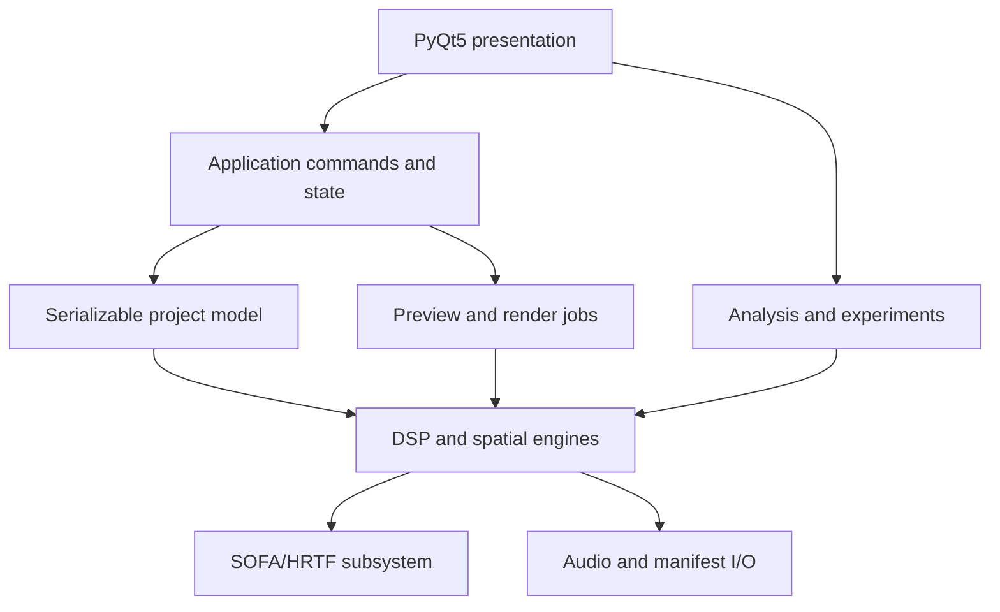
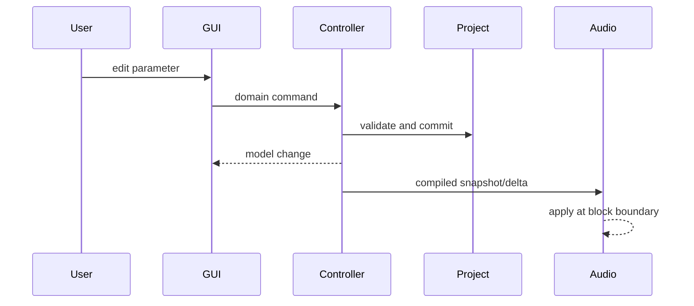

# SAM/HRTF Spatial-Audio Workbench

## Comprehensive Python + PyQt5 implementation plan

**Document purpose:** Give a coding agent enough technical, architectural, and product detail to implement an extensible spatial-angle-modulation (SAM) audio workbench without having to reinterpret the source documents.

**Source basis:**

- `US20130010967A1.pdf` — patent description of spatial angle modulation, path variants, parameterization, multiple sources, and staged sessions.
- `2012-1 (TMIJ) Induction of Expanded States of Consciousness Using Spatial Angle Modulation Audio Support Technology - F. Holmes Atwater.pdf` — explanatory article and experimental/theoretical context.
- Follow-up design discussion covering HRTF creation, modification, interpolation, cue scaling, and personalized measurement.

**Implementation stance:** Reproduce the acoustic mechanisms faithfully, while treating claims about altered consciousness, neural targeting, microtubules, nonlocal effects, or therapeutic outcomes as hypotheses rather than validated product behavior. The application should describe controls in acoustic terms and provide experiment tools for testing subjective effects.

---

## 1. Outcome

Build a desktop application that lets a user construct, audition, analyze, automate, and export stereo spatial-audio scenes in four rendering modes:

1. **Abstract phase modulation** — direct implementation of the patent's opposed-ear phase modulation.
2. **Geometric binaural rendering** — moving sources with time-varying distance, delay, level, and optional Doppler.
3. **HRTF rendering** — dynamic convolution with a SOFA HRTF dataset.
4. **Hybrid rendering** — physical HRTF motion plus intentionally nonphysical cue modulation.

The system must expose a large parameter space without coupling the DSP to the GUI. Every useful numeric parameter should be optionally time-varying, modulatable, reproducible, and serializable.

The initial deliverable should be a reliable offline renderer with responsive preview. Later stages can add real-time head tracking, sensor feedback, personal HRTF measurement/import, multi-source swarms, and multimodal synchronization.

---

## 2. Scope and non-goals

### 2.1 In scope

- Exact patent-style stereo phase modulation.
- Multiple simultaneous carrier/source layers.
- Arbitrary open, closed, discontinuous, transformed, and three-dimensional trajectories.
- Independent path geometry, traversal law, and listener geometry.
- Generic, selected, modified, or personally measured HRTFs in SOFA format.
- Time-varying ITD, ILD, IPD, spectral-shape, coherence, distance, and width controls.
- Multiband spatialization and a broadband spatial-anchor layer.
- Timeline automation, macro session stages, presets, A/B comparison, and deterministic rendering.
- WAV/FLAC export plus a complete machine-readable manifest.
- Objective acoustic analysis and structured subjective evaluation.
- PyQt5 GUI with model/view separation, undo/redo, background rendering, and nonblocking plots.

### 2.2 Explicit non-goals for the first release

- Medical diagnosis, treatment, or guaranteed mental-state induction.
- Claiming that an HRTF can directly target a brain structure or cerebral hemisphere.
- Full room-acoustic simulation, wave-field synthesis, or loudspeaker-array rendering.
- A production-grade digital audio workstation.
- Live personal HRTF measurement inside the first GUI release.
- Mobile deployment.

---

## 3. Source-derived functional requirements

### 3.1 Core SAM model

For a single sinusoidal carrier, implement the opposed-ear phase modulation:

\[
s_L(t)=A(t)\sin\left(\theta_c(t)+\beta_L(t)q_L(\psi_L(t))+\phi_L(t)\right)
\]

\[
s_R(t)=A(t)\sin\left(\theta_c(t)-\beta_R(t)q_R(\psi_R(t))+\phi_R(t)\right)
\]

For the patent's symmetric sinusoidal case:

\[
\theta_c(t)=2\pi f_c t,\quad q(\psi)=\sin(2\pi f_m t),\quad
\beta_L=\beta_R=\beta
\]

which gives:

\[
s_L(t)=A\sin(2\pi f_c t+\beta\sin(2\pi f_m t)+\phi_L)
\]

\[
s_R(t)=A\sin(2\pi f_c t-\beta\sin(2\pi f_m t)+\phi_R)
\]

The instantaneous frequencies are opposed:

\[
f_{L,R}(t)=f_c\pm\beta f_m\cos(2\pi f_m t)
\]

and the instantaneous interaural phase difference is:

\[
\operatorname{IPD}(t)=2\beta\sin(2\pi f_m t)+\phi_L-\phi_R
\]

The engine must support the exact symmetric version and deliberate deviations from it: independent ear depth, rate, waveform, phase, envelope, and bias.

### 3.2 Generalized signal model

Promote the fixed parameters into time-varying controls:

\[
s_e(t)=a_e(t)\,g\left[
\theta_c(t)+\sum_{k=1}^{K}\beta_{e,k}(t)q_k(\psi_k(t))+\phi_e(t)
\right],\quad e\in\{L,R\}
\]

where:

- `g` may be sine, band-limited waveform, wavetable, or source-signal phase transform.
- `theta_c` is accumulated carrier phase, not merely `2π * instantaneous_frequency * t`.
- each `q_k` is an independent modulator.
- every amplitude, phase, depth, frequency, and bias may be automated.

### 3.3 Path requirements

Represent motion as three separable concepts:

1. **Geometry** `C(u)` — where the path exists.
2. **Traversal** `u(t)` — how the source moves along it.
3. **Transform** `T(t)` — translation, rotation, scale, shear, reflection, and deformation.

Support:

- line, arc, circle, ellipse, spiral, helix, Lissajous, spline, Bézier, polygon, and point-cloud paths;
- open and closed paths;
- forward, reverse, ping-pong, loop, one-shot, stochastic, and discontinuous traversal;
- constant speed, eased speed, keyframed speed, arc-length-compensated speed, and externally driven traversal;
- two-dimensional and three-dimensional coordinates;
- multiple synchronized or coupled paths;
- jumps with configurable crossfade rather than an unavoidable click.

### 3.4 Multi-source and staged-session requirements

- Permit any number of sources in the data model; optimize the first release for 1–8 active sources.
- Let sources share, offset, mirror, repel, attract, orbit, phase-lock, or independently traverse paths.
- Provide a macro timeline for named stages such as preparation, disruption, induction, stabilization, and return, but keep stage names user-editable and nonmedical.
- Allow a stage to control groups of lower-level parameters through envelopes or preset transitions.

---

## 4. Degrees-of-freedom inventory

The GUI should expose these through progressive disclosure: a small Basic view, a larger Advanced view, and an Expert/Matrix view.

| Domain | Degrees of freedom |
|---|---|
| Source signal | waveform, file input, carrier frequency, phase, amplitude, harmonic count, harmonic amplitudes/phases, noise color, bandwidth, transient density |
| Modulation | modulator waveform, rate, phase, depth, bias, duty cycle, symmetry, slew, stochastic jitter, per-ear polarity, per-ear depth/rate |
| Geometry | x/y/z, azimuth/elevation/radius, path primitive, control points, transform, deformation, path closure |
| Traversal | position, velocity, acceleration, easing, direction, loops, ping-pong, jump schedule, arc-length mode |
| Listener | location, yaw/pitch/roll, head radius/ear spacing, head motion, reference frame |
| Binaural cues | ITD, ILD, IPD, common delay, spectral pinna cues, interaural coherence, apparent width, externalization, distance |
| HRTF | dataset, subject, interpolation, delay handling, ILD scale, ITD scale, pinna scale, diffuse-field/DTF mode, head-tracking mode |
| Environment | speed of sound, distance law, air absorption, early reflections, late reverb, room mix, occlusion |
| Frequency structure | bands, crossover frequencies, per-band path, per-partial path, anchor bandwidth/level |
| Multi-source relation | shared clock, phase relation, spatial offset, coupling force, formation, density, source birth/death |
| Timeline | scenes, stages, automation, transition curve, duration, loop region, markers, random seed |
| Feedback | head pose, EEG-derived scalar, heart rate, respiration, controller/MIDI/OSC, mapping, range, smoothing, failsafe |
| Output | sample rate, bit depth, channel format, loudness target, limiter, dither, metadata, stem selection |

Every control must declare units, bounds, default, automation capability, smoothing policy, and whether it is safe to change during playback.

---

## 5. Architecture

### 5.1 Design rules

1. The DSP and project model must not import PyQt5.
2. The GUI edits a serializable project model through commands; it never edits renderer state directly.
3. Preview and offline render must share the same DSP primitives.
4. Rendering is driven by immutable project snapshots.
5. All time-varying behavior uses one control-signal interface.
6. Coordinate, phase, delay, loudness, and sample-rate conventions are declared once and tested.
7. HRTF files are immutable inputs; modifications produce derived datasets with provenance.
8. Deterministic randomness requires explicit seeds.
9. Real-time safety takes priority over exact GUI immediacy: GUI changes are queued and applied at block boundaries.
10. Experimental labels and claims are separated from the acoustic parameter implementation.

### 5.2 Layering



Dependency direction is downward only. The application layer may translate Qt events into domain commands; the domain layer must remain usable in a headless CLI and test suite.

### 5.3 Proposed package tree

```text
sam_workbench/
  pyproject.toml
  README.md
  src/sam_workbench/
    __init__.py
    app.py
    cli.py
    version.py
    domain/
      project.py
      source.py
      controls.py
      trajectory.py
      spatializer.py
      listener.py
      timeline.py
      validation.py
      migrations.py
    dsp/
      phase.py
      oscillators.py
      modulators.py
      envelopes.py
      delay.py
      filters.py
      convolution.py
      resample.py
      mixer.py
      limiter.py
      blocks.py
    render/
      base.py
      abstract_pm.py
      geometric.py
      hrtf.py
      hybrid.py
      scene.py
      offline.py
      preview.py
    hrtf/
      sofa_io.py
      validation.py
      coordinates.py
      decomposition.py
      interpolation.py
      modification.py
      selection.py
      cache.py
      measurement.py
    analysis/
      binaural_cues.py
      waveform.py
      spectrum.py
      spectrogram.py
      trajectory_metrics.py
      experiments.py
    io/
      project_json.py
      audio_files.py
      manifests.py
      presets.py
    gui/
      main_window.py
      actions.py
      commands.py
      theme.py
      models/
        scene_tree.py
        automation_table.py
        render_queue.py
      widgets/
        transport.py
        numeric_control.py
        control_binding.py
        inspector.py
        path_editor.py
        timeline.py
        hrtf_lab.py
        analysis_views.py
        ab_compare.py
        render_dialog.py
      controllers/
        project_controller.py
        preview_controller.py
        render_controller.py
        selection_controller.py
    workers/
      task_pool.py
      render_worker.py
      analysis_worker.py
      hrtf_worker.py
  tests/
    unit/
    integration/
    gui/
    audio_regression/
  examples/
  assets/
    presets/
    schemas/
```

---

## 6. Technology choices

### 6.1 Required

- Python 3.11 or newer.
- PyQt5 for the desktop UI.
- NumPy for array DSP.
- SciPy for signal processing, interpolation, spatial indexing, and resampling.
- `soundfile` for WAV/FLAC I/O.
- `sounddevice` for PortAudio preview.
- `sofar` for standards-aware SOFA loading/writing/verification.
- `pyfar` for acoustic-signal utilities, delay analysis, minimum-phase processing, and supporting HRTF operations.
- Pydantic v2 or frozen dataclasses plus JSON Schema for validated project data. Prefer Pydantic if dependency size is acceptable.
- `pytest`, `hypothesis`, and `pytest-qt` for tests.

### 6.2 Optional

- `pyqtgraph` for responsive plots and 2D path editing.
- `pyqtgraph.opengl` or `vispy` for a 3D trajectory view.
- `numba` for verified hot loops only.
- `mido`/`python-osc` for control input.
- `pyloudnorm` for offline loudness reporting.

Do not make an optional package necessary to open a project. Fall back to a simpler view or algorithm with a clear capability message.

---

## 7. Canonical conventions

### 7.1 Coordinates

Use an internal right-handed Cartesian frame:

- `+x`: listener forward
- `+y`: listener left
- `+z`: up
- azimuth `0°`: front
- positive azimuth: toward the left
- elevation: positive upward
- distance: metres

The left receiver is at positive `y`; the right receiver is at negative `y`. Convert explicitly at SOFA import/export boundaries and test the conversion with front, left, right, above, and rear fixtures.

### 7.2 Audio and time

- Internal processing: `float64` for phase/delay accumulation and sensitive analysis; `float32` audio buffers where performance matters.
- Project sample rate default: `44_100 Hz`, configurable to `48_000`, `96_000`, or another validated rate.
- Preview block default: `512` samples; allow `128–2048`.
- Offline block default: `4096` or `8192` samples.
- Time is expressed in seconds at the domain boundary and integer sample indices inside render loops.
- Phase is radians internally and degrees only at user-facing boundaries where useful.
- Level is linear gain internally and decibels in the GUI.

### 7.3 Headphone output

Assume headphone playback for binaural rendering. Add an optional headphone compensation filter, but do not silently apply one. The project manifest must state whether compensation was used.

---

## 8. Project data model

Use versioned, stable IDs and tagged unions. The following types are conceptual; exact Pydantic syntax may vary.

### 8.1 Root model

```python
class Project:
    schema_version: str
    id: UUID
    name: str
    created_utc: datetime
    modified_utc: datetime
    global_audio: GlobalAudioSettings
    listener: ListenerConfig
    environment: EnvironmentConfig
    sources: list[SourceConfig]
    stages: list[StageConfig]
    automation: list[AutomationLane]
    buses: list[BusConfig]
    output: OutputConfig
    experiment: ExperimentConfig | None
    metadata: dict[str, JSONValue]
```

### 8.2 Global audio settings

```python
class GlobalAudioSettings:
    sample_rate_hz: int = 44_100
    preview_block_size: int = 512
    offline_block_size: int = 4096
    master_gain_db: float = -6.0
    limiter_enabled: bool = True
    limiter_ceiling_dbfs: float = -1.0
    speed_of_sound_m_s: float = 343.0
    random_seed: int = 0
```

### 8.3 Source

```python
class SourceConfig:
    id: UUID
    name: str
    enabled: bool
    start_s: float
    duration_s: float | None
    signal: SignalSpec
    amplitude: ControlSpec
    trajectory: TrajectorySpec
    spatializer: SpatializerSpec
    modulators: list[ModulatorSpec]
    routing: RoutingSpec
    tags: list[str]
```

`SignalSpec` variants:

- `SineSignal`
- `HarmonicBankSignal`
- `BandLimitedWaveSignal`
- `NoiseSignal`
- `AudioFileSignal`
- `MultibandSignal`
- `CompositeSignal`

### 8.4 Control specification

Every automatable scalar is represented by one tagged `ControlSpec`:

```python
ControlSpec = (
    ConstantControl
    | KeyframeControl
    | LFOControl
    | StepSequenceControl
    | RandomWalkControl
    | ExpressionControl
    | ExternalControl
    | SumControl
    | ProductControl
    | MapRangeControl
)
```

All controls include:

```python
class ControlBase:
    id: UUID
    unit: str
    minimum: float | None
    maximum: float | None
    smoothing_ms: float
    seed: int | None
    enabled: bool
```

Expression controls must use a restricted parser/AST, not Python `eval`. Permit only documented math functions, named project parameters, time, beat position, and seeded random primitives. Detect cycles during validation.

### 8.5 Trajectory specification

```python
class TrajectorySpec:
    geometry: GeometrySpec
    traversal: TraversalSpec
    transform: TransformSpec
    coordinate_frame: Literal["listener", "world"]
```

Geometry and traversal are independently serializable so that one path can be reused with different timing laws.

### 8.6 Spatializer specification

```python
SpatializerSpec = (
    AbstractPMSpec
    | GeometricBinauralSpec
    | HRTFSpatializerSpec
    | HybridSpatializerSpec
)
```

Example HRTF fields:

```python
class HRTFSpatializerSpec:
    mode: Literal["hrtf"]
    sofa_asset_id: str
    interpolation: Literal["nearest", "barycentric", "sh_logmag_delay"]
    itd_scale: ControlSpec
    ild_scale: ControlSpec
    pinna_scale: ControlSpec
    distance_scale: ControlSpec
    coherence: ControlSpec
    diffuse_field_equalization: bool
    headphone_eq_asset_id: str | None
    crossfade_ms: float
```

### 8.7 Timeline and stages

```python
class StageConfig:
    id: UUID
    name: str
    start_s: float
    duration_s: float
    transition_in_s: float
    transition_out_s: float
    parameter_overrides: list[ParameterBinding]
    notes: str
```

Store automation bindings by stable object ID plus schema-defined parameter path. Do not bind to display names or list indices.

### 8.8 Serialization rules

- JSON project file with `schema_version`.
- Relative asset references when a project is packed; content hashes for integrity.
- Preserve unknown metadata fields during load/save when possible.
- Validate before render and report all errors together.
- Implement explicit schema migrations. Never silently reinterpret an old field.
- Save atomically using a temporary sibling file and rename.

---

## 9. Control engine

### 9.1 Interface

```python
class CompiledControl(Protocol):
    def reset(self, sample_index: int = 0) -> None: ...
    def render(self, start_sample: int, frames: int, sample_rate: float) -> NDArray: ...
```

Controls should compile from declarative specs into efficient stateful renderers. Constant controls may return scalar/broadcast views. Stateful random controls must produce identical output regardless of offline block size; derive values from absolute sample/time or maintain checkpointable state carefully.

### 9.2 Smoothing

- Apply smoothing after control composition and before DSP consumption.
- Provide linear ramp and one-pole smoothing.
- Unit-aware defaults: shorter for amplitude, longer for filter coefficients and HRTF morph parameters.
- A discontinuity intentionally marked as a jump may bypass parameter smoothing, but audio output must still use a short crossfade unless the user explicitly enables click generation for research.

### 9.3 Rate domains

Controls declare one of:

- audio rate;
- block/control rate with interpolation;
- event rate.

The compiler should promote a control to the required rate when it drives a sensitive parameter such as oscillator phase or fractional delay.

---

## 10. DSP engines

### 10.1 Common renderer contract

```python
class SpatialRenderer(Protocol):
    def prepare(self, context: RenderContext, source: CompiledSource) -> None: ...
    def reset(self, sample_index: int = 0) -> None: ...
    def process(self, mono: NDArray, block: RenderBlock) -> NDArray: ...  # (2, n)
    def latency_samples(self) -> int: ...
    def diagnostics(self) -> dict[str, NDArray | float]: ...
```

All engines return stereo in `(channels, frames)` order. They must declare latency and preserve state across blocks.

### 10.2 Oscillator and phase accumulation

For time-varying frequency, compute:

```python
phase[n + 1] = wrap(phase[n] + 2 * pi * frequency[n] / sample_rate)
```

Do not compute `sin(2π * f[n] * t[n])`, which produces incorrect phase for changing frequency. Use a numerically stable accumulator, wrapping periodically to avoid loss of precision.

### 10.3 Abstract phase-modulation renderer

Inputs:

- carrier phase/frequency;
- left and right modulation sums;
- per-ear fixed phase and gain;
- optional common/differential decomposition;
- optional per-ear postfilter.

Required presets:

- exact symmetric SAM;
- asymmetric depth/rate;
- multi-modulator SAM;
- discontinuous spatial phase;
- traditional binaural-beat comparison;
- static diotic comparison.

Validation must calculate peak instantaneous frequency deviation `abs(beta * fm)` for sinusoidal PM and warn when it approaches Nyquist or violates a configured carrier-frequency range.

### 10.4 Geometric binaural renderer

For source position `p_s(t)` and ear position `p_e(t)`:

\[
r_e(t)=\lVert p_s(t)-p_e(t)\rVert,\quad
\tau_e(t)=r_e(t)/c
\]

\[
y_e(t)=G_e(t)\,x(t-\tau_e(t))
\]

Features:

- configurable inverse-distance or custom distance law;
- head orientation transforms;
- fractional delay with cubic/Farrow interpolation for preview and higher-order or frequency-domain processing offline;
- time-varying delay naturally producing Doppler when enabled;
- optional Doppler bypass for creative motion without pitch shift;
- optional simple frequency-dependent head-shadow filter;
- optional early reflection taps and late reverb send.

Do not apply an extra geometric ITD on top of an HRTF that already contains ITD unless the hybrid mode explicitly requests it.

### 10.5 HRTF renderer

The time-varying binaural transfer model is:

\[
Y_e(f,t)=X(f,t)H_e(f,\Omega(t))G_e(f,t)
e^{-j2\pi f\tau_{\text{extra},e}(t)}
\]

where `H_e` is selected/interpolated from the SOFA dataset at direction `Omega(t)`. The extra delay is zero in physically faithful mode.

Processing plan:

1. Load and verify SOFA once.
2. Convert source coordinates into the internal convention.
3. Resolve or bake `Data_Delay` according to one declared policy.
4. Resample all HRIRs once to project sample rate.
5. Decompose each HRIR into common delay, differential delay, minimum-phase response, log magnitude, and optional directional residual.
6. Build a spatial search/interpolation structure.
7. At run time, evaluate direction at control rate.
8. Interpolate delay and log magnitude rather than raw unaligned HRIR samples.
9. Reconstruct or select the target filters.
10. Crossfade filters or use partitioned time-varying convolution without resetting the signal history.

Initial implementation can use nearest-neighbor HRIRs with equal-power crossfades. The production path should interpolate aligned responses on a spherical triangulation or another validated representation.

### 10.6 Hybrid renderer

Apply physical HRTF rendering first, followed by controlled cue transformations:

- extra differential delay/IPD modulation;
- ILD scaling;
- high-frequency pinna-cue scaling;
- coherence reduction or decorrelation;
- apparent-width modulation;
- nonphysical path warp;
- optional per-band or per-partial spatial offsets.

Keep a strict separation between:

- `physical_direction` and its HRTF;
- `creative_cue_transform`;
- final limiter/output gain.

This enables honest A/B comparison between physical, abstract, and hybrid conditions.

### 10.7 Broadband spatial anchor

A 100–300 Hz sine carrier contains little high-frequency energy, so it cannot strongly express the pinna spectral structure used for elevation and front/back localization. Implement an optional low-level broadband or harmonic anchor that follows the same path.

Anchor controls:

- source type: pink noise, shaped noise, sparse grains, harmonic bank, or imported ambience;
- level, default around `-30 dB` relative to the primary source but never silently enabled;
- band limits;
- coherence;
- same, offset, or mirrored path;
- fade and masking controls.

The HRTF Lab should demonstrate the difference between a low-frequency-only carrier and a carrier plus anchor.

### 10.8 Multi-source and multiband rendering

- Render each source to a stereo stem, then mix into named buses.
- Allow per-source or per-band spatializers.
- Crossovers must reconstruct approximately flat magnitude and controlled phase; Linkwitz–Riley is a suitable default.
- Avoid multiplying CPU cost without warning. Estimate render cost from source count, band count, HRIR length, interpolation method, and sample rate.
- Use deterministic source IDs and seeds so solo/mute does not randomly alter unrelated sources.

### 10.9 Output safety

- Default master gain `-6 dB`.
- Click-free transport and parameter changes.
- Look-ahead limiter for export; lightweight safety limiter for preview.
- Peak and true-peak warnings.
- Optional loudness measurement, not forced normalization.
- A prominent preview-level control and a warning for calibration/measurement sweeps.

---

## 11. HRTF subsystem

### 11.1 Preferred initial approach

Start with a licensed generic SOFA HRTF, then add runtime cue morphing. Select a dataset with a sample rate near the project default and adequate spherical coverage. Do not depend on hidden package demo data; store or ask the user to select an explicit SOFA asset and record its license/provenance.

### 11.2 SOFA ingest validation

On import, report:

- convention and version;
- `Data_IR` shape, expected as measurements × receivers × samples;
- receiver count and ordering;
- sampling rate;
- `Data_Delay` shape and nonzero values;
- source-position type, units, coordinate system, and coverage;
- radius/distance coverage;
- missing, duplicated, or nonfinite directions;
- HRIR peak location, tail energy, clipping, and causality;
- global attributes including author, license, and database name.

Block rendering only for fatal problems. Present nonfatal quality warnings in the HRTF Inspector.

### 11.3 Delay policy

Support two explicit policies:

1. `bake_delay_into_ir` — apply `Data_Delay` as fractional sample shifts and write zeros to the derived representation.
2. `preserve_external_delay` — retain minimum-phase filters and apply delay separately at render time.

Never ignore a nonzero `Data_Delay`. Include the selected policy in the project manifest.

### 11.4 HRTF decomposition for modification

Do not simply multiply raw wrapped phase. For each direction:

1. Estimate left/right onset or broadband delay robustly.
2. Separate common delay and differential delay.
3. Remove delay and compute a minimum-phase representation.
4. Convert magnitudes to log magnitude.
5. Separate common and ear-differential magnitude.
6. Optionally split smooth low-order response from high-frequency directional residual.

Conceptually:

\[
D_c=(D_L+D_R)/2,\quad D_d=(D_L-D_R)/2
\]

\[
M_c=(\log|H_L|+\log|H_R|)/2,\quad
M_d=(\log|H_L|-\log|H_R|)/2
\]

Then apply:

\[
D'_L=D_c+s_{ITD}D_d,\quad D'_R=D_c-s_{ITD}D_d
\]

\[
M'_L=M_c+s_{ILD}M_d,\quad M'_R=M_c-s_{ILD}M_d
\]

Scale the high-frequency directional residual separately with `pinna_scale`. Reconstruct causal filters with enough leading and trailing padding. Apply one shared global normalization if needed; never normalize each ear or direction independently, because that destroys ILD.

### 11.5 Recommended cue-scale bounds

Use soft GUI ranges with expert override:

| Parameter | Basic range | Expert range | Neutral |
|---|---:|---:|---:|
| ITD scale | 0.5–1.5 | 0–2.5 | 1.0 |
| ILD scale | 0.5–1.5 | 0–2.5 | 1.0 |
| Pinna scale | 0.5–1.5 | 0–2.0 | 1.0 |
| Coherence | 0.7–1.0 | 0–1 | 1.0 |
| Extra differential delay | ±0.25 ms | ±2 ms | 0 ms |

These are interaction defaults, not physiological claims. Warn when a cue combination is inconsistent with the physical direction.

### 11.6 Interpolation

Implementation order:

1. nearest-neighbor with crossfade;
2. nearest-three spherical/barycentric interpolation after delay alignment;
3. log-magnitude plus delay interpolation;
4. optional spherical-harmonic representation for dense data.

Test interpolation on known grid directions, midpoints, poles, azimuth wraparound, and sparse rear/elevation coverage. Report extrapolation explicitly.

### 11.7 Personalization routes

#### Route A — generic-set selection

Build a guided localization test across candidate HRTFs:

- short, level-balanced test stimuli;
- front/back, elevation, lateral, and distance trials;
- hidden dataset labels;
- repeated trials and confidence scoring;
- choose the subject/dataset minimizing weighted localization error and front/back reversals.

This is the lowest-cost personalization method and should precede measurement.

#### Route B — direct acoustic measurement

Future HRTF Measurement module:

1. Use matched miniature microphones at the ear canal entrance or blocked entrance.
2. Use a two-channel synchronized interface and a full-range loudspeaker.
3. Measure the loudspeaker/reference chain.
4. Play a calibrated exponential sine sweep at a hearing-safe level.
5. Record both ears simultaneously for each known direction.
6. Deconvolve with the inverse sweep.
7. Divide by the regularized reference response.
8. Window before the first strong room reflection.
9. inspect SNR, clipping, repeatability, and onset alignment;
10. write SOFA with accurate coordinates and metadata.

Practical starter grid: `10°` azimuth spacing, `15°` elevation spacing, radius `1–1.5 m`, later refined near perceptually difficult regions. Pose control and repeatability matter more than nominal angular density.

#### Route C — 3D scan and Mesh2HRTF

1. Acquire a detailed head, torso, and pinna scan.
2. Clean and close the mesh without erasing pinna detail.
3. set scale and coordinate axes precisely;
4. place left/right receiver locations;
5. define an evaluation sphere/grid;
6. solve with Mesh2HRTF/NumCalc;
7. export and verify SOFA;
8. compare simulated localization/cues against a generic baseline and any measurements.

Treat this as an advanced import workflow, not a dependency of the core app.

#### Route D — anthropometric/parametric synthesis

Use head width, pinna dimensions, torso dimensions, and optional photos/scans to select or morph a dataset. This is research-grade unless validated. Keep generated metadata and confidence scores.

### 11.8 HRTF Lab output

The GUI should be able to save a derived SOFA file containing:

- modified HRIRs;
- original source asset hash and metadata;
- modification parameters;
- application version;
- delay policy;
- shared normalization gain;
- quality metrics;
- a clear derived-data marker.

Run `sofar` verification before exposing the Save action as successful.

---

## 12. PyQt5 GUI specification

### 12.1 Main window

Use `QMainWindow` with persistent dock layout:

| Region | Default content |
|---|---|
| Top | menus, project actions, transport, time display, preview level, CPU/xrun indicator |
| Left dock | project/scene tree: listener, sources, paths, modulators, buses, stages, assets |
| Center | tabbed path view, timeline, mixer, HRTF Lab, and experiment view |
| Right dock | context-sensitive inspector with Basic/Advanced/Expert modes |
| Bottom dock | analysis plots, render queue, validation issues, log |
| Status bar | sample rate, HRTF subject, active renderer, latency, unsaved state |

Persist dock geometry with `QSettings`, but keep it separate from the portable project file.

### 12.2 Scene tree

Implement `SceneTreeModel(QAbstractItemModel)` around stable domain IDs.

Required operations:

- add, duplicate, rename, enable/disable, solo/mute, delete, and reorder;
- drag a modulator onto a compatible parameter;
- drag a path onto a source;
- reveal asset and validation state;
- multi-select compatible objects for batch edits;
- preserve selection across model refresh by ID.

Every edit should be an undoable `QUndoCommand`.

### 12.3 Inspector

Generate most property rows from parameter metadata rather than hand-coding each editor.

Reusable `NumericControl` should contain:

- label and unit;
- spin box with appropriate decimals and logarithmic/linear behavior;
- optional slider;
- reset-to-default button;
- automation/modulation binding button;
- current evaluated value indicator;
- warning/error badge;
- context menu for copy/paste, learn control, and expose in macro panel.

Do not emit a project command for every slider pixel. Preview locally while dragging, coalesce updates, and commit one undoable command on release.

### 12.4 Path editor

Provide 2D and 3D views with:

- listener/head axes;
- source marker and motion trail;
- ear locations;
- control points and tangents;
- direction arrows and velocity coloring;
- path transform gizmos;
- view presets: top, front, side, listener POV;
- snap, grid, numeric coordinate entry, and unit display;
- time scrub and playhead-linked source position;
- optional representation of the apparent cue-derived direction versus physical direction in hybrid mode.

Use a separate domain command for each geometry mutation. The view should not own canonical path data.

### 12.5 Timeline

Tracks:

- stage blocks;
- source enable/gain;
- parameter automation lanes;
- markers and loop region;
- head/sensor recordings;
- render selection.

Features:

- zoom, pan, snapping, selection, copy/paste, curve handles, and value scaling;
- keyframe interpolation types: hold, linear, smooth cubic, exponential where valid;
- lane folding and search;
- display units and min/max bounds;
- warning for automation faster than the selected control-rate policy.

Use `QAbstractTableModel` or a custom graphics-scene model backed by domain IDs. Keep timeline time in seconds or integer ticks, not pixels.

### 12.6 Modulation matrix

Expert view should show rows as sources/modulators and columns as targets. Each cell contains depth, polarity, mapping curve, and enable state. Detect cycles before committing a binding.

### 12.7 HRTF Lab

Panels:

- asset metadata and validation report;
- spherical coverage map;
- direction selector tied to a head view;
- left/right HRIR waveform;
- magnitude, phase, group delay, ITD, and ILD plots;
- original/modified overlay;
- ITD, ILD, pinna, distance, coherence, and extra-delay controls;
- low-frequency carrier versus spatial-anchor audition;
- A/B/X playback and bypass;
- derive SOFA, verify, and export actions.

Use one global plot-update throttle so rapid parameter movement does not starve audio preview.

### 12.8 Analysis views

At minimum:

- waveform and peak envelope;
- spectrum and spectrogram;
- instantaneous carrier/modulation frequency;
- IPD, ITD, and ILD over time;
- source trajectory and velocity;
- HRTF direction/interpolation index;
- loudness, true peak, and clipping report;
- render performance and xrun counters.

Analysis should be computed in background jobs and cached by project snapshot hash plus analysis parameters.

### 12.9 Presets and progressive disclosure

- Basic mode: carrier, motion rate, motion depth, path shape, path speed, HRTF selection, anchor mix, output gain.
- Advanced mode: ear asymmetry, transformations, cue scales, filters, stage automation, interpolation.
- Expert mode: full modulation matrix, per-band/per-partial routing, nonphysical cue transforms, control-rate and convolution settings.

Presets must be transparent collections of parameter values, never hidden DSP modes. Show a diff before applying a preset to an existing project.

### 12.10 A/B comparison

Support matched-level comparisons:

- abstract SAM vs HRTF;
- HRTF vs hybrid;
- modified vs unmodified HRTF;
- anchor off vs on;
- dynamic vs static;
- user preset vs control condition.

Crossfade safely and compensate known renderer latency. Optionally blind labels for experiments.

---

## 13. State, threading, and real-time behavior

### 13.1 Ownership

- GUI thread owns Qt objects and the editable project model facade.
- Audio callback owns no Qt objects and performs no allocation, file I/O, logging, or lock waits.
- Background workers own HRTF preprocessing, waveform generation, analysis, and offline export.
- Render jobs consume immutable compiled snapshots.

### 13.2 Change flow



### 13.3 Preview engine

- Preallocate ring buffers and convolution state.
- Use a bounded single-producer/single-consumer queue for parameter snapshots or deltas.
- Apply changes at block boundaries with smoothing/crossfade.
- If compilation is expensive, compile in a worker and atomically swap a ready renderer state.
- Report xrun count and callback CPU load through a low-frequency telemetry queue.
- Provide a fallback high-latency block size if the device cannot maintain the chosen configuration.

### 13.4 Offline jobs

Use `QThreadPool`/`QRunnable` or a dedicated worker service for:

- offline render;
- HRTF import/preprocessing;
- SOFA derivation/verification;
- spectrogram and cue analysis;
- waveform thumbnail generation;
- project packing.

Jobs must support cancellation at block boundaries and use progress signals delivered to the GUI thread. Partial output should be clearly marked and normally deleted or moved to a recoverable temporary location after cancellation.

### 13.5 Undo, autosave, and crash recovery

- Use `QUndoStack` with command merging for continuous edits.
- Autosave a recovery snapshot on a timer and before long jobs.
- Do not treat autosave as the user's explicit save.
- On startup, offer recovery only when the recovery snapshot is newer than the project.
- Store HRTF cache separately; caches are regenerable and should never be the only copy of a derived SOFA artifact.

---

## 14. Rendering and asset workflow

### 14.1 Project validation before preview/render

Validate:

- finite parameters and legal ranges;
- sample rate and Nyquist constraints;
- missing assets and content-hash mismatches;
- HRTF receiver count and direction coverage;
- `Data_Delay` policy;
- automation cycles;
- source/path duration mismatch;
- unsupported real-time combinations;
- predicted peak gain and CPU/memory cost;
- experiment condition completeness.

Return structured issues with severity, object ID, parameter path, message, and suggested fix.

### 14.2 Export package

Each render may emit:

- stereo WAV or FLAC;
- optional per-source and per-bus stems;
- project snapshot JSON;
- render manifest JSON;
- optional cue-analysis CSV/JSON;
- optional plots/report.

Manifest fields:

- application and schema versions;
- UTC timestamp;
- project and condition IDs;
- source asset hashes;
- SOFA metadata/hash and license note;
- sample rate, bit depth, duration, channels;
- renderer type and delay/interpolation policies;
- all random seeds;
- master processing and headphone EQ;
- peak, true peak, loudness, and clipping metrics;
- elapsed render time and hardware-independent determinism flags.

### 14.3 Render determinism

Given the same project snapshot, assets, version, and seed, offline renders must be numerically stable within a documented tolerance regardless of block size. Exact bit equality is preferred for the same platform and dependency lock.

---

## 15. Experiment and evidence mode

The source article includes speculative mechanisms. The software should make controlled testing easier rather than encoding those mechanisms as facts.

Features:

- condition builder with hidden labels;
- randomized and counterbalanced order;
- exact seed and parameter capture;
- matched-level control stimuli;
- subjective rating forms and free-text notes;
- optional task-performance measures;
- export without personally identifying data by default;
- comparison conditions: silence, diotic carrier, static HRTF, conventional binaural beat, abstract SAM, physical HRTF motion, hybrid motion, anchor off/on;
- no medical claims in preset names or tooltips.

If physiological sensors are added, store raw or derived inputs separately from conclusions. Provide dropout detection, bounds, smoothing, and a neutral fallback mapping.

---

## 16. Test strategy

### 16.1 Unit tests

- oscillator phase continuity across arbitrary block boundaries;
- fixed and time-varying frequency accuracy;
- exact symmetric SAM equation against a direct NumPy reference;
- instantaneous-frequency bounds;
- deterministic controls independent of block size;
- path evaluation, transforms, arc-length traversal, wrapping, and jumps;
- coordinate conversions including azimuth wrap and SOFA boundary cases;
- fractional-delay impulse position and gain;
- distance law and speed-of-sound behavior;
- common/differential HRTF decomposition/reconstruction;
- ITD/ILD scale neutrality at `1.0` and collapse at `0.0`;
- no independent normalization of ears/directions;
- SOFA round trip and metadata preservation;
- schema validation and migration.

### 16.2 Property-based tests

- no NaN/inf for legal parameter ranges;
- path outputs remain finite under random transforms;
- phase remains bounded after wrapping;
- controls respect declared bounds after mapping;
- derived HRTFs remain finite and causal within tolerance;
- save/load/save preserves semantic equality.

### 16.3 Integration tests

- render one source in each mode;
- switch modes at a stage transition without clicks;
- dynamic direction crossing front/left/rear/right;
- nearest-neighbor HRTF crossfade without state reset;
- resample HRTF to project rate and render;
- render with nonzero `Data_Delay` under both policies;
- multi-source bus mix and stem alignment;
- cancellation and recovery of a long render;
- missing-asset repair workflow.

### 16.4 Audio regression tests

Store small synthetic fixtures and compare metrics rather than only full waveforms:

- RMS and peak;
- cross-correlation and delay;
- spectral magnitude error;
- phase/IPD error;
- ITD/ILD trajectory error;
- click detector around transitions;
- tail-energy/causality checks;
- renderer latency.

Use golden files only for stable, version-pinned algorithms.

### 16.5 GUI tests

With `pytest-qt`:

- project create/open/save and dirty-state behavior;
- scene selection and inspector binding;
- undo/redo for scalar, path, and automation edits;
- slider command coalescing;
- drag/drop bindings;
- timeline keyframe editing;
- background job progress/cancel;
- GUI remains responsive during HRTF analysis and offline render;
- no widget access from worker/audio threads;
- settings restore after relaunch.

### 16.6 Performance tests

Benchmark at 44.1 and 48 kHz:

- 1, 4, and 8 sources;
- 128-, 512-, and 2048-tap HRIRs;
- nearest and interpolated HRTF modes;
- anchor enabled/disabled;
- 1, 4, and 8 frequency bands;
- preview block sizes 128–1024.

Define a reference machine and target less than 50% average callback load for supported real-time presets, leaving safety margin for OS jitter.

---

## 17. Phased implementation roadmap

### Phase 0 — Repository and decisions

Tasks:

- initialize package, dependency groups, formatting, type checks, tests, and CI;
- define coordinate/audio conventions and project schema version `1.0`;
- create domain interfaces and a headless CLI shell;
- choose one explicitly licensed generic SOFA fixture for development;
- add small synthetic SOFA and impulse fixtures created specifically for tests.

Exit criteria:

- package installs in a clean environment;
- headless project validates;
- test suite and GUI smoke test run in CI;
- no production code depends on bundled third-party demo assets.

### Phase 1 — Exact SAM and control engine

Tasks:

- implement phase accumulators, oscillators, modulators, envelopes, and `ControlSpec` compiler;
- implement exact and generalized abstract PM renderer;
- implement WAV export and render manifest;
- add reference tests for equations, phase continuity, and determinism;
- add CLI command to render a minimal JSON project.

Exit criteria:

- exact patent-style stereo output matches the mathematical reference;
- renders are block-size invariant within tolerance;
- no clicks at ordinary automation transitions;
- CLI produces audio and manifest.

### Phase 2 — PyQt5 application shell

Tasks:

- implement main window, project controller, scene tree, inspector, transport, and validation dock;
- add `QUndoStack`, save/load, recent files, autosave/recovery, and settings;
- implement responsive preview for abstract PM;
- add waveform/spectrum/IPD views;
- build metadata-driven numeric controls.

Exit criteria:

- a user can construct, audition, automate, save, reopen, and export an abstract SAM scene;
- GUI remains responsive during export;
- undo/redo and save/load round trips pass.

### Phase 3 — Geometry and paths

Tasks:

- implement listener/source transforms and geometry primitives;
- implement traversal laws, arc-length parameterization, discontinuities, and crossfades;
- implement geometric binaural renderer with fractional delay, distance, and optional Doppler;
- build 2D path editor and basic 3D viewer;
- add trajectory and cue-analysis plots.

Exit criteria:

- paths are visually and numerically consistent;
- moving-source ITD and level match analytic fixtures;
- discontinuities obey configured transition behavior.

### Phase 4 — SOFA and HRTF rendering

Tasks:

- implement SOFA loader, validator, coordinate conversion, resampling, delay policies, and cache;
- implement nearest-neighbor HRTF renderer with click-free crossfades;
- implement aligned log-magnitude/delay interpolation;
- add HRTF Inspector and spherical coverage view;
- add A/B comparison with geometric and abstract renderers.

Exit criteria:

- valid SOFA assets render at project sample rate;
- nonzero `Data_Delay` is handled explicitly;
- neutral import/reconstruction stays within defined spectral and delay tolerances;
- moving HRTF playback has no filter-switch clicks.

### Phase 5 — HRTF modification and hybrid mode

Tasks:

- implement common/differential decomposition;
- implement ITD, ILD, pinna, coherence, and extra-delay transformations;
- implement derived SOFA writing, provenance, and verification;
- implement hybrid renderer and broadband spatial anchor;
- add HRTF Lab controls, plots, and blinded A/B/X audition.

Exit criteria:

- all cue controls are neutral at defaults;
- modified datasets preserve intended common response and ear relationships;
- saved derived SOFA files pass verification;
- anchor on/off comparison is level controlled.

### Phase 6 — Timeline, multiband, and multi-source

Tasks:

- implement full automation timeline and stage blocks;
- implement buses, stems, multiband routing, and source coupling;
- implement modulation matrix and parameter search;
- add cost estimator and offline fallback for expensive scenes.

Exit criteria:

- at least eight sources and four bands are supported offline;
- supported real-time presets meet callback-load target;
- stage transitions and multi-source renders are deterministic.

### Phase 7 — Personalization and experiment tooling

Tasks:

- build generic-HRTF selection/localization test;
- build experiment condition builder, randomization, rating capture, and export;
- prototype measurement import/deconvolution tools behind an Advanced flag;
- add Mesh2HRTF import guidance and validation.

Exit criteria:

- a blinded localization session can rank candidate HRTFs reproducibly;
- experiment exports contain complete acoustic provenance;
- measurement tools enforce calibration and quality checks.

### Phase 8 — Optimization and release

Tasks:

- profile and optimize verified bottlenecks;
- add partitioned convolution if required;
- complete accessibility, keyboard navigation, error handling, onboarding, and documentation;
- freeze example projects and regression fixtures;
- package installers and dependency licenses.

Exit criteria:

- no known data-loss or real-time safety defects;
- project migration, crash recovery, and long renders are tested;
- user documentation clearly separates acoustic features from speculative claims.

---

## 18. Ticket-ready implementation order

An autonomous coding agent should take work in this dependency order:

1. Define conventions and typed project schema.
2. Implement `ControlSpec` and block-invariant phase accumulation.
3. Implement headless exact SAM renderer and tests.
4. Implement audio export, manifests, validation, and CLI.
5. Add PyQt5 shell and project-command layer.
6. Add preview engine with safe thread boundary.
7. Add geometry/path domain and editor.
8. Add geometric binaural renderer.
9. Add SOFA validation and HRTF preprocessing.
10. Add nearest/crossfaded HRTF rendering.
11. Add aligned interpolation and HRTF Lab plots.
12. Add cue decomposition/modification and derived SOFA export.
13. Add hybrid renderer and spatial anchor.
14. Add full timeline, multiband, and multi-source features.
15. Add experiment and personalization workflows.
16. Profile, optimize, package, and document.

For each ticket, require:

- a domain/API change description;
- serialized-schema impact;
- unit and integration tests;
- real-time/thread-safety note;
- GUI behavior if applicable;
- migration or compatibility note;
- acceptance evidence.

---

## 19. Initial defaults that prevent design paralysis

Use these until testing justifies a change:

| Decision | Initial default |
|---|---|
| Python | 3.11+ |
| GUI | PyQt5 |
| Project rate | 44.1 kHz, configurable |
| Preview block | 512 samples |
| Offline block | 4096 samples |
| Audio output | stereo float32 internally; WAV PCM-24 or float32 export |
| HRTF format | SOFA `SimpleFreeFieldHRIR` |
| HRTF interpolation MVP | nearest neighbor + equal-power crossfade |
| HRTF production interpolation | aligned delay + log magnitude |
| Render source count | 1–8 optimized, unlimited data model |
| Path frame | listener-relative by default |
| Physical cue scales | 1.0 |
| Extra creative cues | disabled |
| Anchor | disabled; suggested audition level around -30 dB |
| Master gain | -6 dB |
| Export limiter | on, -1 dBFS ceiling |
| External sensors | disabled until a later phase |

---

## 20. Acceptance criteria for the complete workbench

The product is implementation-complete when all of the following are true:

1. Exact symmetric SAM matches the reference equations and remains phase-continuous across blocks.
2. A project can use any of the four render modes and can switch conditions without uncontrolled clicks.
3. Every important numeric parameter can be constant or driven by the common control system.
4. Paths separate geometry, traversal, and transform and support 3D, discontinuities, and automation.
5. SOFA import validates metadata, coordinates, receiver order, sample rate, and delay handling.
6. HRTF motion interpolates or crossfades without resetting convolution history.
7. Neutral HRTF modification is measurably equivalent to the source within declared tolerance.
8. ITD/ILD/pinna controls modify only their intended decomposed components as closely as the chosen algorithm permits.
9. A derived SOFA file contains provenance and passes verification.
10. Low-frequency-only and spatial-anchor conditions can be compared at matched level.
11. The GUI does not block during HRTF analysis or offline rendering.
12. Undo/redo, autosave/recovery, and project migration are tested.
13. Offline output is deterministic for fixed project/assets/seeds.
14. Export manifests are sufficient to reconstruct an experimental condition.
15. The application uses acoustic language and clearly labels speculative interpretations.
16. Preview and export include hearing-safety controls and peak warnings.

---

## 21. Major risks and mitigations

| Risk | Mitigation |
|---|---|
| Raw HRIR interpolation causes combing or image jumps | align delays; interpolate delay/log magnitude; crossfade statefully |
| HRTF already contains ITD and geometry adds it again | enforce renderer ownership; hybrid extra delay must be explicit |
| Per-direction normalization destroys ILD | use one shared global gain only |
| Nonzero SOFA `Data_Delay` is ignored | mandatory ingest policy and validation test |
| Low-frequency carrier cannot convey pinna cues | optional broadband/harmonic spatial anchor |
| Too many controls overwhelm users | Basic/Advanced/Expert modes, search, presets, macros |
| GUI edits destabilize audio | immutable compiled snapshots, block-boundary swaps, smoothing |
| Stateful random controls vary with block size | absolute-time/seed design and block-invariance tests |
| HRTF licenses are unclear | explicit asset provenance and license field; do not silently bundle |
| Scientific claims outrun evidence | neutral acoustic naming, control conditions, experiment mode |
| Measurement sweeps risk hearing discomfort | calibrated levels, limiter, warnings, short sessions, stop control |
| CPU grows with sources/bands/HRIR length | cost estimator, quality modes, cache, partitioned convolution, offline fallback |
| Project schema evolves | versioned schema and explicit migrations |

---

## 22. Instructions for implementing agents

- Start from the headless domain/DSP layer. Do not build important behavior only inside Qt widgets.
- Preserve the exact SAM mode even after more sophisticated HRTF modes are added; it is a reference condition.
- Treat a parameter as time-varying unless there is a documented reason it cannot be.
- Use `apply_patch` for code edits, preserve unrelated user changes, and add tests with each behavior change.
- Prefer small, pure functions for phase, delay, coordinate, HRTF decomposition, and interpolation math.
- Keep units in names (`_hz`, `_s`, `_ms`, `_db`, `_m`, `_deg`) at API boundaries.
- Record renderer latency and align A/B comparisons and stems.
- Never use `eval` for expressions and never execute project-supplied code.
- Never touch Qt widgets from the audio callback or worker threads.
- Never silently repair an HRTF in a way that changes cues; generate an explicit derived asset.
- When a method is perceptual or heuristic, document the assumption and expose diagnostics.
- Add a minimal example project and a deterministic CLI render for every major renderer.
- Before optimizing, collect a profile and keep a correctness test for the replaced implementation.
- Any preset referring to focus, sleep, meditation, or consciousness must be described as a subjective intent, not an assured outcome.

---

## 23. Reference resources

- Patent record: <https://patents.google.com/patent/US20130010967A1/en>
- SOFA convention overview: <https://www.sofaconventions.org/mediawiki/index.php/SOFA_%28Spatially_Oriented_Format_for_Acoustics%29>
- SOFA HRTF databases: <https://sofacoustics.org/data/database/>
- LISTEN HRTF database: <https://sofacoustics.org/data/database/listen%20%28hrtf%29/>
- `sofar` documentation: <https://sofar.readthedocs.io/en/v1.1.3/working_with_sofa_files.html>
- `pyfar` DSP documentation: <https://pyfar.readthedocs.io/en/latest/modules/pyfar.dsp.html>
- Mesh2HRTF: <https://github.com/Any2HRTF/Mesh2HRTF>

The two attached PDFs remain the primary project-specific sources. External resources define file formats, software APIs, and implementation techniques rather than validating the speculative consciousness claims.

