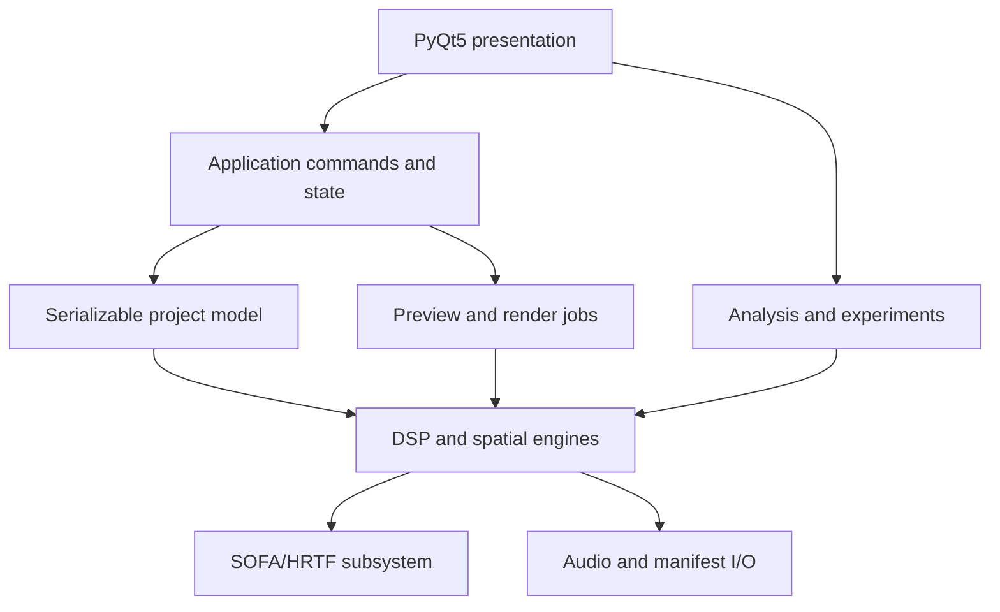
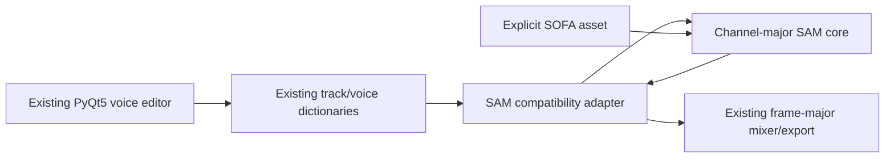
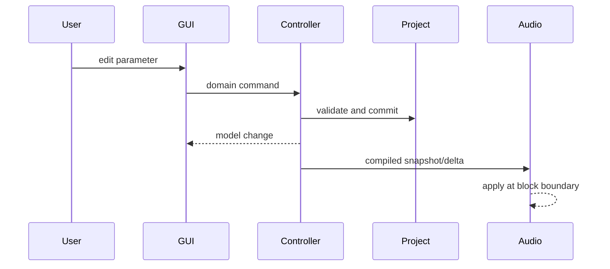

# SAM/HRTF Spatial-Audio Workbench

## Comprehensive Python + PyQt5 implementation plan

**Document purpose:** Give a coding agent enough technical, architectural, repository, and product detail to add an extensible spatial-angle-modulation (SAM) and HRTF workbench to the existing BinauralBuilder application without having to reinterpret the source documents or rediscover the current codebase.

**Target repository:** <https://github.com/abehlok2/BinauralBuilder>, default branch `main`.

**Repository inspection baseline:** tree `2615eb0197fd8f167071a97513589ed2b431a450`, inspected 2026-08-20. Reinspect the current branch before implementation because file paths and partial phase work may have changed.

**Revision status:** Repository-specific revision. This version supersedes the earlier greenfield package and GUI assumptions.

**Source basis:**

- `US20130010967A1.pdf` — patent description of spatial angle modulation, path variants, parameterization, multiple sources, and staged sessions.
- `2012-1 (TMIJ) Induction of Expanded States of Consciousness Using Spatial Angle Modulation Audio Support Technology - F. Holmes Atwater.pdf` — explanatory article and experimental/theoretical context.
- Follow-up design discussion covering HRTF creation, modification, interpolation, cue scaling, and personalized measurement.
- Read-only inspection of the BinauralBuilder Python synthesis, track/session, test, and PyQt5 code as it existed on the inspected `main` branch.

**Implementation stance:** Reproduce the acoustic mechanisms faithfully, while treating claims about altered consciousness, neural targeting, microtubules, nonlocal effects, or therapeutic outcomes as hypotheses rather than validated product behavior. The application should describe controls in acoustic terms and provide experiment tools for testing subjective effects.

---

## 0. Target repository and current implementation state

This work extends BinauralBuilder; it does not create a second application. Preserve the existing entry points, track JSON, voice presets, session files, and PyQt5 editing workflow while introducing a clean SAM/HRTF core behind compatibility adapters.

### 0.1 Scope boundary

The Rust code is entirely out of scope. Do not modify, port, test, document, or require changes in:

- `src/realtime_backend/`;
- `src/audio/rust_stream_player.py`;
- Rust voice parity, Rust streaming, WebAssembly, GPU, or foreign-function interfaces.

All implementation and acceptance work in this plan concerns the Python offline/rendering path and PyQt5 GUI. Existing Rust behavior may remain untouched. A feature that is unavailable through a Rust-backed preview must use a Python preview/export path or clearly report that limitation; it must not silently substitute a different acoustic algorithm.

### 0.2 Existing integration points

| Existing path | Current role | Required treatment |
|---|---|---|
| `main.py` | Main PyQt5 `TrackEditorApp`, project/track editing, preview/export entry points | Extend existing actions and dialogs; do not replace the main window |
| `src/ui/voice_editor_dialog.py` | Voice selection, parameter editors, SAM/SAM2 definitions, preset editing | Primary SAM/HRTF GUI integration point; consolidate duplicated SAM parameter metadata before expanding it |
| `src/ui/custom_path_creator_dialog.py` | Two-dimensional draggable custom paths with smoothing and loop closure | Reuse the interaction model; add explicit coordinate normalization, physical scale, and schema versioning |
| `src/ui/spatial_trajectory_dialog.py` | Segment-based rotate/oscillate/rotating-arc trajectories | Reuse or adapt through a trajectory translator instead of inventing an incompatible second segment format |
| `src/synth_functions/sound_creator.py` | Dynamic synth discovery, per-voice generation, chunking, mixing, transitions, export | Main Python rendering boundary; add a thin adapter and preserve its `(frames, 2)` contract |
| `src/synth_functions/spatial_angle_modulation.py` | Legacy HRTF SAM, SAM2 opposed-phase rendering, custom path evaluation | Preserve public function names; migrate internals to the new core incrementally |
| `src/synth_functions/audio_engine.py` | Legacy `slab.HRTF.kemar()` SAM with framewise nearest-HRTF overlap-add | Freeze as legacy compatibility code; do not build the new HRTF subsystem inside it |
| `src/models/models.py` | Existing `StepModel` and `VoiceModel` Qt table models | Extend only where the current editor needs new display data; do not introduce a parallel scene model in the minimum viable integration |
| `src/ui/session_builder_window.py` | Separate session-building GUI which consumes preset catalogs and can prefer a non-Python preview backend | Do not alter its Rust behavior; ensure SAM presets remain loadable and its Python export path resolves the canonical renderer |
| `binauralbuilder_core/session.py` and `assembly.py` | Session-to-track conversion and Python session assembly/export | Preserve their public API and make their SAM voices reach the canonical renderer through delegation |
| `binauralbuilder_core/` | Second Python synthesis/session tree and compatibility-oriented core package | Prevent SAM divergence by delegating to one canonical implementation; do not copy new DSP into both trees |
| `tests/test_sam_phase_zero.py` | Expected conventions, project validation, atomic persistence, command-line shell | Treat as the first executable contract |
| `tests/test_sam_phase_one.py` | Expected block-invariant control, exact SAM equation, WAV/manifest output | Treat as the second executable contract |

### 0.3 Confirmed gaps and incompatibilities

1. `tests/test_sam_phase_zero.py` and `tests/test_sam_phase_one.py` import `src.audio.sam_workbench`, but that package is absent on the inspected branch. Test collection will fail until it is created.
2. The current `src` SAM2 renderer uses opposed left/right phase terms and is the closer reference implementation. The duplicate `binauralbuilder_core` SAM2 implementation differs mathematically and must not remain an independent source of truth.
3. The proposed SAM core and its tests use channel-major arrays `(2, frames)`, while BinauralBuilder synthesis functions and mixers use frame-major arrays `(frames, 2)`. This boundary must have one explicit, tested transpose adapter.
4. `sound_creator.generate_voice_audio()` passes `initial_offset=chunk_start_time` to static generators and can also pass state between chunks. Current static SAM2 ignores that offset, and transition SAM2 restarts portions of its accumulated phase. The replacement must render from an absolute sample index or a complete checkpointable phase state.
5. Existing custom-path points are GUI-scene coordinates measured in pixels. They are not metres and cannot be passed directly to a physical HRTF renderer.
6. Legacy `slab` coordinates use a different axis/sign convention from the canonical coordinates defined in this document. Every legacy, GUI, and SOFA boundary requires an explicit converter.
7. `slab.HRTF.kemar()` is loaded implicitly and can fail when package data is unavailable. The new HRTF path must select an explicit SOFA asset and must not depend on hidden demonstration data.
8. The current legacy HRTF renderer selects a nearest HRTF per short frame and overlap-adds the filtered frames. It is useful only as a compatibility baseline; it is not the target interpolation/convolution architecture.
9. SAM parameter definitions appear in more than one configuration block in `voice_editor_dialog.py`. Adding fields to only one block can create inconsistent static/transition or default/preset behavior.

### 0.4 Migration strategy

- Create one canonical, Qt-free Python package at `src/audio/sam_workbench/` because the existing tests already define that import contract.
- Keep `src/synth_functions/spatial_angle_modulation.py` as the public compatibility adapter used by existing tracks and `.voice` presets.
- Make any corresponding `binauralbuilder_core` SAM entry points delegate to the canonical package instead of maintaining another algorithm copy.
- Preserve existing camelCase voice parameters at the track/preset boundary and translate them into unit-explicit snake_case core models.
- Add new renderer modes and parameters without invalidating old JSON. Missing new fields must reproduce the appropriate existing behavior.
- Introduce the new GUI as widgets/dialogs within the existing editor. A full dockable workbench may be added later, but a second `QMainWindow` is not part of the initial integration.

---

## 1. Outcome

Extend the BinauralBuilder desktop application so a user can construct, audition, analyze, automate, and export stereo spatial-audio voices in four rendering modes:

1. **Abstract phase modulation** — direct implementation of the patent's opposed-ear phase modulation.
2. **Geometric binaural rendering** — moving sources with time-varying distance, delay, level, and optional Doppler.
3. **HRTF rendering** — dynamic convolution with a SOFA HRTF dataset.
4. **Hybrid rendering** — physical HRTF motion plus intentionally nonphysical cue modulation.

The system must expose a large parameter space without coupling the DSP to the GUI. Every useful numeric parameter should be optionally time-varying, modulatable, reproducible, and serializable.

The initial deliverable is a reliable Python offline renderer, BinauralBuilder voice adapter, and existing-GUI integration. Responsive Python preview follows once output continuity is proven. Later stages can add head tracking, sensor feedback, personal HRTF measurement/import, multi-source swarms, and multimodal synchronization.

---

## 2. Scope and non-goals

### 2.1 In scope

- Exact patent-style stereo phase modulation.
- Multiple simultaneous carrier/source layers.
- Arbitrary open, closed, discontinuous, transformed, and three-dimensional trajectories.
- Independent path geometry, traversal law, and listener geometry.
- Generic, selected, modified, or personally measured HRTFs in SOFA format.
- Time-varying ITD, ILD, IPD, spectral-shape, coherence, distance, and width controls.
- Multiband spatialization and a broadband spatial-anchor layer.
- Timeline automation, macro session stages, presets, A/B comparison, and deterministic rendering.
- WAV/FLAC export plus a complete machine-readable manifest.
- Objective acoustic analysis and structured subjective evaluation.
- PyQt5 GUI with model/view separation, undo/redo, background rendering, and nonblocking plots.

### 2.2 Explicit non-goals for the first release

- Medical diagnosis, treatment, or guaranteed mental-state induction.
- Claiming that an HRTF can directly target a brain structure or cerebral hemisphere.
- Full room-acoustic simulation, wave-field synthesis, or loudspeaker-array rendering.
- A production-grade digital audio workstation.
- Live personal HRTF measurement inside the first GUI release.
- Mobile deployment.

---

## 3. Source-derived functional requirements

### 3.1 Core SAM model

For a single sinusoidal carrier, implement the opposed-ear phase modulation:

\[
s_L(t)=A(t)\sin\left(\theta_c(t)+\beta_L(t)q_L(\psi_L(t))+\phi_L(t)\right)
\]

\[
s_R(t)=A(t)\sin\left(\theta_c(t)-\beta_R(t)q_R(\psi_R(t))+\phi_R(t)\right)
\]

For the patent's symmetric sinusoidal case:

\[
\theta_c(t)=2\pi f_c t,\quad q(\psi)=\sin(2\pi f_m t),\quad
\beta_L=\beta_R=\beta
\]

which gives:

\[
s_L(t)=A\sin(2\pi f_c t+\beta\sin(2\pi f_m t)+\phi_L)
\]

\[
s_R(t)=A\sin(2\pi f_c t-\beta\sin(2\pi f_m t)+\phi_R)
\]

The instantaneous frequencies are opposed:

\[
f_{L,R}(t)=f_c\pm\beta f_m\cos(2\pi f_m t)
\]

and the instantaneous interaural phase difference is:

\[
\operatorname{IPD}(t)=2\beta\sin(2\pi f_m t)+\phi_L-\phi_R
\]

The engine must support the exact symmetric version and deliberate deviations from it: independent ear depth, rate, waveform, phase, envelope, and bias.

### 3.2 Generalized signal model

Promote the fixed parameters into time-varying controls:

\[
s_e(t)=a_e(t)\,g\left[
\theta_c(t)+\sum_{k=1}^{K}\beta_{e,k}(t)q_k(\psi_k(t))+\phi_e(t)
\right],\quad e\in\{L,R\}
\]

where:

- `g` may be sine, band-limited waveform, wavetable, or source-signal phase transform.
- `theta_c` is accumulated carrier phase, not merely `2π * instantaneous_frequency * t`.
- each `q_k` is an independent modulator.
- every amplitude, phase, depth, frequency, and bias may be automated.

### 3.3 Path requirements

Represent motion as three separable concepts:

1. **Geometry** `C(u)` — where the path exists.
2. **Traversal** `u(t)` — how the source moves along it.
3. **Transform** `T(t)` — translation, rotation, scale, shear, reflection, and deformation.

Support:

- line, arc, circle, ellipse, spiral, helix, Lissajous, spline, Bézier, polygon, and point-cloud paths;
- open and closed paths;
- forward, reverse, ping-pong, loop, one-shot, stochastic, and discontinuous traversal;
- constant speed, eased speed, keyframed speed, arc-length-compensated speed, and externally driven traversal;
- two-dimensional and three-dimensional coordinates;
- multiple synchronized or coupled paths;
- jumps with configurable crossfade rather than an unavoidable click.

### 3.4 Multi-source and staged-session requirements

- Permit any number of sources in the data model; optimize the first release for 1–8 active sources.
- Let sources share, offset, mirror, repel, attract, orbit, phase-lock, or independently traverse paths.
- Provide a macro timeline for named stages such as preparation, disruption, induction, stabilization, and return, but keep stage names user-editable and nonmedical.
- Allow a stage to control groups of lower-level parameters through envelopes or preset transitions.

---

## 4. Degrees-of-freedom inventory

The GUI should expose these through progressive disclosure: a small Basic view, a larger Advanced view, and an Expert/Matrix view.

| Domain | Degrees of freedom |
|---|---|
| Source signal | waveform, file input, carrier frequency, phase, amplitude, harmonic count, harmonic amplitudes/phases, noise color, bandwidth, transient density |
| Modulation | modulator waveform, rate, phase, depth, bias, duty cycle, symmetry, slew, stochastic jitter, per-ear polarity, per-ear depth/rate |
| Geometry | x/y/z, azimuth/elevation/radius, path primitive, control points, transform, deformation, path closure |
| Traversal | position, velocity, acceleration, easing, direction, loops, ping-pong, jump schedule, arc-length mode |
| Listener | location, yaw/pitch/roll, head radius/ear spacing, head motion, reference frame |
| Binaural cues | ITD, ILD, IPD, common delay, spectral pinna cues, interaural coherence, apparent width, externalization, distance |
| HRTF | dataset, subject, interpolation, delay handling, ILD scale, ITD scale, pinna scale, diffuse-field/DTF mode, head-tracking mode |
| Environment | speed of sound, distance law, air absorption, early reflections, late reverb, room mix, occlusion |
| Frequency structure | bands, crossover frequencies, per-band path, per-partial path, anchor bandwidth/level |
| Multi-source relation | shared clock, phase relation, spatial offset, coupling force, formation, density, source birth/death |
| Timeline | scenes, stages, automation, transition curve, duration, loop region, markers, random seed |
| Feedback | head pose, EEG-derived scalar, heart rate, respiration, controller/MIDI/OSC, mapping, range, smoothing, failsafe |
| Output | sample rate, bit depth, channel format, loudness target, limiter, dither, metadata, stem selection |

Every control must declare units, bounds, default, automation capability, smoothing policy, and whether it is safe to change during playback.

---

## 5. Architecture

### 5.1 Design rules

1. The DSP and project model must not import PyQt5.
2. Existing track JSON and `.voice` preset dictionaries remain supported; typed models sit behind adapters rather than requiring an immediate application-wide schema rewrite.
3. The GUI edits serializable specifications; it never owns canonical DSP state.
4. Preview and offline render must share the same Python DSP primitives.
5. Rendering is driven by immutable or defensively copied specifications and an absolute sample origin.
6. All time-varying behavior uses one control-signal interface.
7. Coordinate, phase, delay, loudness, array-shape, and sample-rate conventions are declared once and tested.
8. HRTF files are immutable inputs; modifications produce derived datasets with provenance.
9. Deterministic randomness requires explicit seeds.
10. GUI changes are coalesced and applied between render blocks or preview jobs; no worker thread may touch Qt widgets.
11. The same SAM algorithm must never be separately implemented in both `src` and `binauralbuilder_core`.
12. Experimental labels and claims are separated from the acoustic parameter implementation.

### 5.2 Layering



Dependency direction is downward only. The application layer may translate Qt events into domain commands; the domain layer must remain usable in a headless CLI and test suite.

### 5.3 Repository package and adapter tree

```text
AGENTS.md                                      # this implementation specification
main.py                                        # existing TrackEditorApp; retain
src/
  audio/
    sam_workbench/                             # canonical new Qt-free implementation
      __init__.py
      cli.py
      conventions.py
      controls.py
      model.py
      validation.py
      export.py
      version.py
      migrations.py
      dsp/
        __init__.py
        phase.py
        oscillators.py
        modulators.py
        envelopes.py
        delay.py
        filters.py
        convolution.py
        resample.py
        mixer.py
        limiter.py
        blocks.py
      trajectory/
        __init__.py
        geometry.py
        traversal.py
        transforms.py
        legacy_paths.py
      render/
        __init__.py
        base.py
        abstract_pm.py
        geometric.py
        hrtf.py
        hybrid.py
        scene.py
      hrtf/
        __init__.py
        sofa_io.py
        validation.py
        coordinates.py
        decomposition.py
        interpolation.py
        modification.py
        selection.py
        cache.py
        measurement.py
      analysis/
        __init__.py
        binaural_cues.py
        waveform.py
        spectrum.py
        spectrogram.py
        trajectory_metrics.py
        experiments.py
  synth_functions/
    spatial_angle_modulation.py                # existing public-name adapter
    sound_creator.py                           # existing discovery/chunk/mix boundary
    audio_engine.py                            # legacy slab implementation; freeze
  ui/
    voice_editor_dialog.py                     # existing primary editor integration
    custom_path_creator_dialog.py              # extend/translate; do not duplicate
    spatial_trajectory_dialog.py               # extend/translate; do not duplicate
    sam_workbench_dialog.py                    # new specialized container
    sam_basic_panel.py
    sam_path_panel.py
    sam_hrtf_lab.py
    sam_analysis_panel.py
  models/
    models.py                                   # existing StepModel/VoiceModel
binauralbuilder_core/
  synth_functions/
    spatial_angle_modulation.py                # compatibility delegation only
tests/
  test_sam_phase_zero.py                       # existing executable contract
  test_sam_phase_one.py                        # existing executable contract
  sam_workbench/
    test_compat_adapter.py
    test_chunk_continuity.py
    test_trajectory.py
    test_sofa_io.py
    test_hrtf_render.py
    test_hrtf_modification.py
    test_gui_integration.py
    fixtures/
      synthetic_hrir.sofa
      minimal_track.json
      legacy_sam_voice.voice
```

Do not create a separate top-level application package, `app.py`, or second main window for the minimum viable implementation. The canonical core is nested under the existing `src.audio` namespace because current tests already depend on it.

### 5.4 Compatibility boundaries



The adapter owns all legacy naming and shape conversion:

- camelCase parameters to typed snake_case fields;
- `initial_offset` seconds to absolute `start_sample`;
- `(frames, 2)` to/from `(2, frames)`;
- GUI pixel paths to normalized/physical trajectories;
- legacy path names to canonical geometry/traversal specifications;
- static/transition parameter pairs to common control signals;
- old missing fields to versioned defaults.

The core must not import `sound_creator`, `main.py`, `voice_editor_dialog`, `slab`, or any Qt module.

---

## 6. Technology choices

### 6.1 Required

- Python 3.11 or newer, while retaining compatibility with the repository's supported interpreter range.
- The repository's existing pinned base stack: PyQt5 5.15.11, NumPy 2.2.5, SciPy 1.15.2, and `soundfile`.
- PyQt5 QtMultimedia for the existing preview path. Do not introduce a second mandatory audio-device backend solely for SAM.
- Frozen dataclasses and explicit validators for the first core schema so the Phase 0/1 package does not require an application-wide Pydantic migration. JSON Schema generation may be added later.
- `sofar` for standards-aware SOFA loading, writing, and verification once HRTF mode is enabled.
- `pyfar` for delay analysis, minimum-phase processing, resampling support, and HRTF utilities once HRTF mode is enabled.
- `pytest`, `hypothesis`, and `pytest-qt` in the development/test dependency group.

Declare `sofar` and `pyfar` as a clearly named HRTF feature dependency group if maintaining the ability to install and use non-HRTF BinauralBuilder features without them is important. The GUI must then disable HRTF controls with an actionable dependency message rather than failing application import.

### 6.2 Optional

- `pyqtgraph` for responsive plots and 2D path editing.
- `pyqtgraph.opengl` or `vispy` for a 3D trajectory view.
- `numba` for verified hot loops only.
- `sounddevice` only if a later isolated preview engine demonstrably needs PortAudio; it is not part of the initial integration.
- `mido`/`python-osc` for control input.
- `pyloudnorm` for offline loudness reporting.

Do not make an optional package necessary to open a project. Fall back to a simpler view or algorithm with a clear capability message.

Keep the existing `slab` dependency temporarily for legacy voices, but the new SAM/HRTF core must not import it. Remove `slab` only after old presets and the legacy `spatial_angle_modulation` entry point have an explicit migration or compatibility path.

---

## 7. Canonical conventions

### 7.1 Coordinates

Use an internal right-handed Cartesian frame:

- `+x`: listener forward
- `+y`: listener left
- `+z`: up
- azimuth `0°`: front
- positive azimuth: toward the left
- elevation: positive upward
- distance: metres

The left receiver is at positive `y`; the right receiver is at negative `y`. Convert explicitly at SOFA import/export boundaries and test the conversion with front, left, right, above, and rear fixtures.

Repository boundary rules:

- `custom_path_creator_dialog.py` currently produces scene/pixel coordinates. Store the unmodified legacy profile for round-trip compatibility, but translate it through `LegacyPathTransform` using a declared centre, axis orientation, normalization extent, and `metres_per_scene_unit` before physical rendering.
- Existing custom paths use ear labels `A` and `B`; the new editor must label left/right explicitly after confirming the visual orientation, while retaining old serialized data.
- The legacy `slab` renderer comments describe `+x` as right and `+y` as forward with positive azimuth to the right. Convert that convention only in a named legacy converter. Never let those signs leak into the canonical core.
- SOFA coordinate metadata is authoritative at import. Convert from the file's declared units/type into the canonical frame; do not assume every SOFA file uses the same stored representation.

### 7.2 Audio and time

- Internal processing: `float64` for phase/delay accumulation and sensitive analysis; `float32` audio buffers where performance matters.
- Project sample rate default: `44_100 Hz`, configurable to `48_000`, `96_000`, or another validated rate.
- Preview block default: `512` samples; allow `128–2048`.
- Offline block default: `4096` or `8192` samples.
- Time is expressed in seconds at the domain boundary and integer sample indices inside render loops.
- Every core render call receives an absolute `start_sample`. Derive it with a documented rounding rule from BinauralBuilder's `chunk_start_time`; do not treat a time offset as an angle.
- Phase is radians internally and degrees only at user-facing boundaries where useful.
- Level is linear gain internally and decibels in the GUI.
- The SAM core returns `(channels, frames)` to match its mathematical/tests API. The existing BinauralBuilder adapter returns `(frames, 2)` to `sound_creator`. Perform this conversion exactly once at the adapter boundary.
- Existing BinauralBuilder track mixing and final peak normalization may apply one shared gain to both channels. No SAM/HRTF component may normalize ears independently.

### 7.3 Headphone output

Assume headphone playback for binaural rendering. Add an optional headphone compensation filter, but do not silently apply one. The project manifest must state whether compensation was used.

---

## 8. Project data model

Use versioned, stable IDs and tagged unions inside the new core, but do not replace BinauralBuilder's complete track/session model in the first implementation. The following types describe the typed SAM subsystem and a possible future full scene model.

### 8.0 BinauralBuilder compatibility envelope

The existing application serializes tracks approximately as:

```python
track_data = {
    "global_settings": {...},
    "steps": [
        {
            "start": 0.0,
            "duration": 60.0,
            "voices": [
                {
                    "synth_function_name": "spatial_angle_modulation_sam2",
                    "is_transition": False,
                    "voice_type": "binaural",
                    "params": {...},
                }
            ],
        }
    ],
    "background_noise": {...},
    "clips": [...],
}
```

Keep this outer representation. Introduce a versioned SAM payload inside `params` and accept legacy flat parameters:

```python
params = {
    "samSchemaVersion": 1,
    "rendererMode": "abstract_pm",  # abstract_pm | geometric | hrtf | hybrid
    "amp": 0.7,
    "carrierFreq": 440.0,
    "modFreq": 4.0,
    "phaseDepthRad": 1.0,
    "arcWidthDeg": 90.0,
    "directionOffsetDeg": 0.0,
    "spatialScale": 1.0,
    "pathType": "open",
    "pathShape": "sinusoidal",
    "customPathProfile": {...},
    "hrtfAsset": None,
    "hrtfOptions": {...},
}
```

Compatibility behavior:

- Existing `spatial_angle_modulation_sam2` voices without `samSchemaVersion` load as legacy SAM2 and are translated to the nearest neutral abstract-PM specification. Preserve their current left-minus/right-plus polarity through an explicit legacy-orientation flag; the new exact reference mode follows the tested left-plus/right-minus equations.
- Existing `spatial_angle_modulation` voices continue to select the legacy `slab` renderer until explicitly migrated or until an opt-in compatibility translator is validated.
- Existing transition fields such as `startCarrierFreq` and `endCarrierFreq` compile into `ControlSpec` keyframes. Do not retain separate transition DSP algorithms after compatibility parity is established.
- Preserve unknown parameters during GUI edit/save where possible so older or external extensions are not erased.
- Store explicit HRTF asset paths and content hashes. Do not embed an absolute development-machine path into reusable presets without also supporting project-relative resolution.

The `Project` type below is required for the standalone SAM command-line/tests API and may later become a richer scene document. The BinauralBuilder adapter may construct a minimal `Project` containing one or more translated voices without migrating the entire track file.

### 8.1 Root model

```python
class Project:
    schema_version: str
    id: UUID
    name: str
    created_utc: datetime
    modified_utc: datetime
    global_audio: GlobalAudioSettings
    listener: ListenerConfig
    environment: EnvironmentConfig
    sources: list[SourceConfig]
    stages: list[StageConfig]
    automation: list[AutomationLane]
    buses: list[BusConfig]
    output: OutputConfig
    experiment: ExperimentConfig | None
    metadata: dict[str, JSONValue]
```

### 8.2 Global audio settings

```python
class GlobalAudioSettings:
    sample_rate_hz: int = 44_100
    preview_block_size: int = 512
    offline_block_size: int = 4096
    master_gain_db: float = -6.0
    limiter_enabled: bool = True
    limiter_ceiling_dbfs: float = -1.0
    speed_of_sound_m_s: float = 343.0
    random_seed: int = 0
```

### 8.3 Source

```python
class SourceConfig:
    id: UUID
    name: str
    enabled: bool
    start_s: float
    duration_s: float | None
    signal: SignalSpec
    amplitude: ControlSpec
    trajectory: TrajectorySpec
    spatializer: SpatializerSpec
    modulators: list[ModulatorSpec]
    routing: RoutingSpec
    tags: list[str]
```

`SignalSpec` variants:

- `SineSignal`
- `HarmonicBankSignal`
- `BandLimitedWaveSignal`
- `NoiseSignal`
- `AudioFileSignal`
- `MultibandSignal`
- `CompositeSignal`

### 8.4 Control specification

Every automatable scalar is represented by one tagged `ControlSpec`:

```python
ControlSpec = (
    ConstantControl
    | KeyframeControl
    | LFOControl
    | StepSequenceControl
    | RandomWalkControl
    | ExpressionControl
    | ExternalControl
    | SumControl
    | ProductControl
    | MapRangeControl
)
```

All controls include:

```python
class ControlBase:
    id: UUID
    unit: str
    minimum: float | None
    maximum: float | None
    smoothing_ms: float
    seed: int | None
    enabled: bool
```

Expression controls must use a restricted parser/AST, not Python `eval`. Permit only documented math functions, named project parameters, time, beat position, and seeded random primitives. Detect cycles during validation.

### 8.5 Trajectory specification

```python
class TrajectorySpec:
    geometry: GeometrySpec
    traversal: TraversalSpec
    transform: TransformSpec
    coordinate_frame: Literal["listener", "world"]
```

Geometry and traversal are independently serializable so that one path can be reused with different timing laws.

### 8.6 Spatializer specification

```python
SpatializerSpec = (
    AbstractPMSpec
    | GeometricBinauralSpec
    | HRTFSpatializerSpec
    | HybridSpatializerSpec
)
```

Example HRTF fields:

```python
class HRTFSpatializerSpec:
    mode: Literal["hrtf"]
    sofa_asset_id: str
    interpolation: Literal["nearest", "barycentric", "sh_logmag_delay"]
    itd_scale: ControlSpec
    ild_scale: ControlSpec
    pinna_scale: ControlSpec
    distance_scale: ControlSpec
    coherence: ControlSpec
    diffuse_field_equalization: bool
    headphone_eq_asset_id: str | None
    crossfade_ms: float
```

### 8.7 Timeline and stages

```python
class StageConfig:
    id: UUID
    name: str
    start_s: float
    duration_s: float
    transition_in_s: float
    transition_out_s: float
    parameter_overrides: list[ParameterBinding]
    notes: str
```

Store automation bindings by stable object ID plus schema-defined parameter path. Do not bind to display names or list indices.

### 8.8 Serialization rules

- JSON project file with `schema_version`.
- Relative asset references when a project is packed; content hashes for integrity.
- Preserve unknown metadata fields during load/save when possible.
- Validate before render and report all errors together.
- Implement explicit schema migrations. Never silently reinterpret an old field.
- Save atomically using a temporary sibling file and rename.

---

## 9. Control engine

### 9.1 Interface

```python
class CompiledControl(Protocol):
    def reset(self, sample_index: int = 0) -> None: ...
    def render(self, start_sample: int, frames: int, sample_rate: float) -> NDArray: ...
```

Controls should compile from declarative specs into efficient stateful renderers. Constant controls may return scalar/broadcast views. Stateful random controls must produce identical output regardless of offline block size; derive values from absolute sample/time or maintain checkpointable state carefully.

### 9.2 Smoothing

- Apply smoothing after control composition and before DSP consumption.
- Provide linear ramp and one-pole smoothing.
- Unit-aware defaults: shorter for amplitude, longer for filter coefficients and HRTF morph parameters.
- A discontinuity intentionally marked as a jump may bypass parameter smoothing, but audio output must still use a short crossfade unless the user explicitly enables click generation for research.

### 9.3 Rate domains

Controls declare one of:

- audio rate;
- block/control rate with interpolation;
- event rate.

The compiler should promote a control to the required rate when it drives a sensitive parameter such as oscillator phase or fractional delay.

### 9.4 BinauralBuilder chunk integration

`sound_creator.generate_voice_audio()` and `generate_single_step_audio_segment()` may render a step in multiple chunks. The SAM adapter must therefore:

1. convert `chunk_start_time` to `start_sample = round(chunk_start_time * sample_rate)` using one tested rounding policy;
2. evaluate all stateless controls from that absolute sample index;
3. accept an optional serialized `synth_state` containing oscillator/filter/convolution state when a renderer cannot be reconstructed from absolute time alone;
4. return the updated state through the existing `(audio, state)` convention when requested;
5. make whole-step and arbitrarily chunked renders match within an algorithm-specific tolerance;
6. avoid resetting carrier phase, modulator phase, delay history, random streams, or HRTF convolution tails at a chunk boundary.

For constant-frequency abstract SAM, absolute sample evaluation should be sufficient and is preferred over mutable phase state. For time-varying frequency, integrate from a defined control origin or use a checkpointed accumulator; do not restart `numpy.cumsum` at each chunk.

---

## 10. DSP engines

### 10.1 Common renderer contract

```python
class SpatialRenderer(Protocol):
    def prepare(self, context: RenderContext, source: CompiledSource) -> None: ...
    def reset(self, sample_index: int = 0) -> None: ...
    def process(self, mono: NDArray, block: RenderBlock) -> NDArray: ...  # (2, n)
    def latency_samples(self) -> int: ...
    def diagnostics(self) -> dict[str, NDArray | float]: ...
```

All engines return stereo in `(channels, frames)` order. They must declare latency and preserve state across blocks.

### 10.2 Oscillator and phase accumulation

For time-varying frequency, compute:

```python
phase[n + 1] = wrap(phase[n] + 2 * pi * frequency[n] / sample_rate)
```

Do not compute `sin(2π * f[n] * t[n])`, which produces incorrect phase for changing frequency. Use a numerically stable accumulator, wrapping periodically to avoid loss of precision.

### 10.3 Abstract phase-modulation renderer

Inputs:

- carrier phase/frequency;
- left and right modulation sums;
- per-ear fixed phase and gain;
- optional common/differential decomposition;
- optional per-ear postfilter.

Required presets:

- exact symmetric SAM;
- asymmetric depth/rate;
- multi-modulator SAM;
- discontinuous spatial phase;
- traditional binaural-beat comparison;
- static diotic comparison.

Validation must calculate peak instantaneous frequency deviation `abs(beta * fm)` for sinusoidal PM and warn when it approaches Nyquist or violates a configured carrier-frequency range.

Repository integration:

- Implement the tested canonical equation in `src.audio.sam_workbench`.
- Convert the existing `spatial_angle_modulation_sam2()` and `_transition()` functions into compatibility wrappers after parity tests exist.
- Retain their public names so existing track JSON and `.voice` presets continue to resolve through dynamic discovery.
- Preserve the legacy `src` SAM2 ear-polarity orientation for unversioned presets; expose canonical and reversed orientation explicitly for new voices.
- Change `binauralbuilder_core.synth_functions.spatial_angle_modulation` to delegate to the same implementation. Its current independently implemented SAM2 behavior must not remain an alternate algorithm under the same function name.
- Keep `spatial_angle_modulation()` backed by the old `SAMVoice` only as a labeled legacy mode until migration is tested. Do not silently change an old preset from HRTF filtering to abstract phase modulation.

### 10.4 Geometric binaural renderer

For source position `p_s(t)` and ear position `p_e(t)`:

\[
r_e(t)=\lVert p_s(t)-p_e(t)\rVert,\quad
\tau_e(t)=r_e(t)/c
\]

\[
y_e(t)=G_e(t)\,x(t-\tau_e(t))
\]

Features:

- configurable inverse-distance or custom distance law;
- head orientation transforms;
- fractional delay with cubic/Farrow interpolation for preview and higher-order or frequency-domain processing offline;
- time-varying delay naturally producing Doppler when enabled;
- optional Doppler bypass for creative motion without pitch shift;
- optional simple frequency-dependent head-shadow filter;
- optional early reflection taps and late reverb send.

Do not apply an extra geometric ITD on top of an HRTF that already contains ITD unless the hybrid mode explicitly requests it.

### 10.5 HRTF renderer

The time-varying binaural transfer model is:

\[
Y_e(f,t)=X(f,t)H_e(f,\Omega(t))G_e(f,t)
e^{-j2\pi f\tau_{\text{extra},e}(t)}
\]

where `H_e` is selected/interpolated from the SOFA dataset at direction `Omega(t)`. The extra delay is zero in physically faithful mode.

Processing plan:

1. Load and verify SOFA once.
2. Convert source coordinates into the internal convention.
3. Resolve or bake `Data_Delay` according to one declared policy.
4. Resample all HRIRs once to project sample rate.
5. Decompose each HRIR into common delay, differential delay, minimum-phase response, log magnitude, and optional directional residual.
6. Build a spatial search/interpolation structure.
7. At run time, evaluate direction at control rate.
8. Interpolate delay and log magnitude rather than raw unaligned HRIR samples.
9. Reconstruct or select the target filters.
10. Crossfade filters or use partitioned time-varying convolution without resetting the signal history.

Initial implementation can use nearest-neighbor HRIRs with equal-power crossfades. The production path should interpolate aligned responses on a spherical triangulation or another validated representation.

This renderer is a new implementation under `src/audio/sam_workbench/hrtf`; it must not call `slab.HRTF.kemar()` or reuse the per-frame `SAMVoice` overlap-add loop. The selected SOFA path, file hash, subject metadata, delay policy, resampling policy, and interpolation mode must be part of the compiled specification and render manifest. Cache keys must include all of those values plus target sample rate and every cue-modification parameter that affects preprocessed filters.

### 10.6 Hybrid renderer

Apply physical HRTF rendering first, followed by controlled cue transformations:

- extra differential delay/IPD modulation;
- ILD scaling;
- high-frequency pinna-cue scaling;
- coherence reduction or decorrelation;
- apparent-width modulation;
- nonphysical path warp;
- optional per-band or per-partial spatial offsets.

Keep a strict separation between:

- `physical_direction` and its HRTF;
- `creative_cue_transform`;
- final limiter/output gain.

This enables honest A/B comparison between physical, abstract, and hybrid conditions.

### 10.7 Broadband spatial anchor

A 100–300 Hz sine carrier contains little high-frequency energy, so it cannot strongly express the pinna spectral structure used for elevation and front/back localization. Implement an optional low-level broadband or harmonic anchor that follows the same path.

Anchor controls:

- source type: pink noise, shaped noise, sparse grains, harmonic bank, or imported ambience;
- level, default around `-30 dB` relative to the primary source but never silently enabled;
- band limits;
- coherence;
- same, offset, or mirrored path;
- fade and masking controls.

The HRTF Lab should demonstrate the difference between a low-frequency-only carrier and a carrier plus anchor.

### 10.8 Multi-source and multiband rendering

- Render each source to a stereo stem, then mix into named buses.
- Allow per-source or per-band spatializers.
- Crossovers must reconstruct approximately flat magnitude and controlled phase; Linkwitz–Riley is a suitable default.
- Avoid multiplying CPU cost without warning. Estimate render cost from source count, band count, HRIR length, interpolation method, and sample rate.
- Use deterministic source IDs and seeds so solo/mute does not randomly alter unrelated sources.

### 10.9 Output safety

- Default master gain `-6 dB`.
- Click-free transport and parameter changes.
- Look-ahead limiter for export; lightweight safety limiter for preview.
- Peak and true-peak warnings.
- Optional loudness measurement, not forced normalization.
- A prominent preview-level control and a warning for calibration/measurement sweeps.

---

## 11. HRTF subsystem

### 11.1 Preferred initial approach

Start with a licensed generic SOFA HRTF, then add runtime cue morphing. Select a dataset with a sample rate near the project default and adequate spherical coverage. Do not depend on hidden package demo data; store or ask the user to select an explicit SOFA asset and record its license/provenance.

### 11.2 SOFA ingest validation

On import, report:

- convention and version;
- `Data_IR` shape, expected as measurements × receivers × samples;
- receiver count and ordering;
- sampling rate;
- `Data_Delay` shape and nonzero values;
- source-position type, units, coordinate system, and coverage;
- radius/distance coverage;
- missing, duplicated, or nonfinite directions;
- HRIR peak location, tail energy, clipping, and causality;
- global attributes including author, license, and database name.

Block rendering only for fatal problems. Present nonfatal quality warnings in the HRTF Inspector.

### 11.3 Delay policy

Support two explicit policies:

1. `bake_delay_into_ir` — apply `Data_Delay` as fractional sample shifts and write zeros to the derived representation.
2. `preserve_external_delay` — retain minimum-phase filters and apply delay separately at render time.

Never ignore a nonzero `Data_Delay`. Include the selected policy in the project manifest.

### 11.4 HRTF decomposition for modification

Do not simply multiply raw wrapped phase. For each direction:

1. Estimate left/right onset or broadband delay robustly.
2. Separate common delay and differential delay.
3. Remove delay and compute a minimum-phase representation.
4. Convert magnitudes to log magnitude.
5. Separate common and ear-differential magnitude.
6. Optionally split smooth low-order response from high-frequency directional residual.

Conceptually:

\[
D_c=(D_L+D_R)/2,\quad D_d=(D_L-D_R)/2
\]

\[
M_c=(\log|H_L|+\log|H_R|)/2,\quad
M_d=(\log|H_L|-\log|H_R|)/2
\]

Then apply:

\[
D'_L=D_c+s_{ITD}D_d,\quad D'_R=D_c-s_{ITD}D_d
\]

\[
M'_L=M_c+s_{ILD}M_d,\quad M'_R=M_c-s_{ILD}M_d
\]

Scale the high-frequency directional residual separately with `pinna_scale`. Reconstruct causal filters with enough leading and trailing padding. Apply one shared global normalization if needed; never normalize each ear or direction independently, because that destroys ILD.

### 11.5 Recommended cue-scale bounds

Use soft GUI ranges with expert override:

| Parameter | Basic range | Expert range | Neutral |
|---|---:|---:|---:|
| ITD scale | 0.5–1.5 | 0–2.5 | 1.0 |
| ILD scale | 0.5–1.5 | 0–2.5 | 1.0 |
| Pinna scale | 0.5–1.5 | 0–2.0 | 1.0 |
| Coherence | 0.7–1.0 | 0–1 | 1.0 |
| Extra differential delay | ±0.25 ms | ±2 ms | 0 ms |

These are interaction defaults, not physiological claims. Warn when a cue combination is inconsistent with the physical direction.

### 11.6 Interpolation

Implementation order:

1. nearest-neighbor with crossfade;
2. nearest-three spherical/barycentric interpolation after delay alignment;
3. log-magnitude plus delay interpolation;
4. optional spherical-harmonic representation for dense data.

Test interpolation on known grid directions, midpoints, poles, azimuth wraparound, and sparse rear/elevation coverage. Report extrapolation explicitly.

### 11.7 Personalization routes

#### Route A — generic-set selection

Build a guided localization test across candidate HRTFs:

- short, level-balanced test stimuli;
- front/back, elevation, lateral, and distance trials;
- hidden dataset labels;
- repeated trials and confidence scoring;
- choose the subject/dataset minimizing weighted localization error and front/back reversals.

This is the lowest-cost personalization method and should precede measurement.

#### Route B — direct acoustic measurement

Future HRTF Measurement module:

1. Use matched miniature microphones at the ear canal entrance or blocked entrance.
2. Use a two-channel synchronized interface and a full-range loudspeaker.
3. Measure the loudspeaker/reference chain.
4. Play a calibrated exponential sine sweep at a hearing-safe level.
5. Record both ears simultaneously for each known direction.
6. Deconvolve with the inverse sweep.
7. Divide by the regularized reference response.
8. Window before the first strong room reflection.
9. inspect SNR, clipping, repeatability, and onset alignment;
10. write SOFA with accurate coordinates and metadata.

Practical starter grid: `10°` azimuth spacing, `15°` elevation spacing, radius `1–1.5 m`, later refined near perceptually difficult regions. Pose control and repeatability matter more than nominal angular density.

#### Route C — 3D scan and Mesh2HRTF

1. Acquire a detailed head, torso, and pinna scan.
2. Clean and close the mesh without erasing pinna detail.
3. set scale and coordinate axes precisely;
4. place left/right receiver locations;
5. define an evaluation sphere/grid;
6. solve with Mesh2HRTF/NumCalc;
7. export and verify SOFA;
8. compare simulated localization/cues against a generic baseline and any measurements.

Treat this as an advanced import workflow, not a dependency of the core app.

#### Route D — anthropometric/parametric synthesis

Use head width, pinna dimensions, torso dimensions, and optional photos/scans to select or morph a dataset. This is research-grade unless validated. Keep generated metadata and confidence scores.

### 11.8 HRTF Lab output

The GUI should be able to save a derived SOFA file containing:

- modified HRIRs;
- original source asset hash and metadata;
- modification parameters;
- application version;
- delay policy;
- shared normalization gain;
- quality metrics;
- a clear derived-data marker.

Run `sofar` verification before exposing the Save action as successful.

---

## 12. PyQt5 GUI specification

### 12.1 Main window

Retain `main.py::TrackEditorApp` as the application `QMainWindow`. Integrate SAM/HRTF through the existing voice-edit and track-edit workflow:

1. Existing step/voice selection remains the entry point.
2. `VoiceEditorDialog` exposes a concise SAM summary and an **Open SAM/HRTF Workbench** action when a compatible voice is selected.
3. `SamWorkbenchDialog` is initially a modeless or modal `QDialog`/`QWidget` owned by the existing editor. It edits a copy and commits through the current voice-data save path on Apply/OK.
4. The dialog contains tabs for Basic SAM, Path, HRTF, Modulation, Analysis, and Advanced/Compatibility settings.
5. HRTF preprocessing and plots run in background workers; the existing window remains responsive.
6. A later release may convert this widget into a dock, but it must not require replacing `TrackEditorApp`.

Use the existing theme system and settings conventions. Persist workbench geometry/UI preferences separately from portable track and voice data.

### 12.2 Scene tree

Do not add a parallel `SceneTreeModel` in the first integration. Continue using the existing `StepModel`, `VoiceModel`, track tree/widgets, and their current voice dictionaries. Add only the roles/columns needed to display renderer mode, HRTF asset status, or SAM validation state.

If the future scene system requires nested sources, modulators, buses, and paths, introduce a stable-ID `QAbstractItemModel` after the typed model and migration format are mature. Until then, a complex scene remains represented by multiple existing voices in a step, with optional shared IDs in their SAM parameter payloads.

### 12.3 Inspector

`voice_editor_dialog.py` already generates parameter controls from static/default metadata and function inspection. Before adding the expanded parameter set:

1. consolidate the duplicated SAM/SAM2 standard and transition parameter tables into one registry;
2. give every field a core name, legacy aliases, unit, bounds, decimals, default, tooltip, mode visibility, and transition/automation policy;
3. keep current camelCase serialized keys at the compatibility boundary;
4. use specialized widgets for SOFA files, custom paths, cue groups, and automation rather than forcing them through a numeric editor;
5. preserve unknown parameters when a voice is opened and saved.

Generate most ordinary property rows from that registry instead of adding more hand-coded conditionals.

Reusable `NumericControl` should contain:

- label and unit;
- spin box with appropriate decimals and logarithmic/linear behavior;
- optional slider;
- reset-to-default button;
- automation/modulation binding button;
- current evaluated value indicator;
- warning/error badge;
- context menu for copy/paste, learn control, and expose in macro panel.

Do not emit a project command for every slider pixel. Preview locally while dragging, coalesce updates, and commit one undoable command on release.

### 12.4 Path editor

Extend `custom_path_creator_dialog.py` rather than creating a competing two-dimensional editor. Preserve its double-click point creation, draggable points, deletion, linear/spline drawing, loop closure, seeded shapes, and Chaikin controls. Add:

- listener/head axes;
- source marker and motion trail;
- ear locations;
- control points and tangents;
- direction arrows and velocity coloring;
- path transform gizmos;
- view presets: top, front, side, listener POV;
- snap, grid, numeric coordinate entry, and unit display;
- time scrub and playhead-linked source position;
- optional representation of the apparent cue-derived direction versus physical direction in hybrid mode.

Legacy profiles remain readable in their original scene coordinates. Versioned profiles add coordinate metadata such as:

```python
{
    "schemaVersion": 2,
    "coordinateSpace": "normalized_listener_2d",
    "sceneUnitsPerMetre": 100.0,
    "axisConvention": "x_right_y_down",
    "closedLoop": False,
    "points": [[...], ...],
    "smoothingPasses": 1,
    "smoothingRatio": 0.25,
}
```

Translate this representation into canonical three-dimensional coordinates outside the widget. Use `spatial_trajectory_dialog.py` segments as an importable traversal source for rotate, oscillate, and rotating-arc behavior. A later three-dimensional view may be added beside the existing editor; it must consume the same canonical trajectory rather than own another path format.

### 12.5 Timeline

Use BinauralBuilder's existing step progression, `start`, `duration`, crossfade fields, transition voices, and timeline visualization as the first macro timeline. Map a step or contiguous group of steps to a named experimental/session stage without replacing the complete track format.

Future SAM-specific lanes may include:

- stage blocks;
- source enable/gain;
- parameter automation lanes;
- markers and loop region;
- head/sensor recordings;
- render selection.

Features:

- zoom, pan, snapping, selection, copy/paste, curve handles, and value scaling;
- keyframe interpolation types: hold, linear, smooth cubic, exponential where valid;
- lane folding and search;
- display units and min/max bounds;
- warning for automation faster than the selected control-rate policy.

Store future automation lanes inside a versioned SAM payload and compile them to `ControlSpec`. Keep time in seconds or integer samples, never pixels. Extend the existing timeline UI only after static and start/end transition compatibility is complete; otherwise the new lane system will compete with the current step-transition model.

### 12.6 Modulation matrix

Expert view should show rows as sources/modulators and columns as targets. Each cell contains depth, polarity, mapping curve, and enable state. Detect cycles before committing a binding.

### 12.7 HRTF Lab

Panels:

- asset metadata and validation report;
- spherical coverage map;
- direction selector tied to a head view;
- left/right HRIR waveform;
- magnitude, phase, group delay, ITD, and ILD plots;
- original/modified overlay;
- ITD, ILD, pinna, distance, coherence, and extra-delay controls;
- low-frequency carrier versus spatial-anchor audition;
- A/B/X playback and bypass;
- derive SOFA, verify, and export actions.

Use one global plot-update throttle so rapid parameter movement does not starve audio preview.

Implement this as `src/ui/sam_hrtf_lab.py` hosted by `SamWorkbenchDialog`. The SOFA selector must show the resolved file, hash, subject/database metadata, sampling rate, coverage, and `Data_Delay` status. Never present the legacy implicit KEMAR object as though it were an explicit, reproducible asset.

### 12.8 Analysis views

At minimum:

- waveform and peak envelope;
- spectrum and spectrogram;
- instantaneous carrier/modulation frequency;
- IPD, ITD, and ILD over time;
- source trajectory and velocity;
- HRTF direction/interpolation index;
- loudness, true peak, and clipping report;
- render performance and xrun counters.

Analysis should be computed in background jobs and cached by project snapshot hash plus analysis parameters.

### 12.9 Presets and progressive disclosure

- Basic mode: carrier, motion rate, motion depth, path shape, path speed, HRTF selection, anchor mix, output gain.
- Advanced mode: ear asymmetry, transformations, cue scales, filters, stage automation, interpolation.
- Expert mode: full modulation matrix, per-band/per-partial routing, nonphysical cue transforms, control-rate and convolution settings.

Presets must be transparent collections of parameter values, never hidden DSP modes. Show a diff before applying a preset to an existing project.

### 12.10 A/B comparison

Support matched-level comparisons:

- abstract SAM vs HRTF;
- HRTF vs hybrid;
- modified vs unmodified HRTF;
- anchor off vs on;
- dynamic vs static;
- user preset vs control condition.

Crossfade safely and compensate known renderer latency. Optionally blind labels for experiments.

---

## 13. State, threading, and real-time behavior

### 13.1 Ownership

- GUI thread owns Qt objects and the editable project model facade.
- The initial Python preview is generated outside the GUI thread and handed to the existing QtMultimedia playback path. It does not require a new hard-real-time callback architecture.
- Background workers own HRTF preprocessing, waveform generation, analysis, and offline export.
- Render jobs consume immutable compiled snapshots.
- If a later Python streaming callback is introduced, it owns no Qt objects and performs no allocation, file I/O, logging, or unbounded lock waits.

### 13.2 Change flow



### 13.3 Preview engine

Initial integration:

- Render a bounded preview selection or test step through the same Python adapter used for export.
- Run synthesis and HRTF preprocessing in a worker, then deliver a complete audio buffer to the existing PyQt5 QtMultimedia player.
- Cancel or supersede stale preview jobs when parameters change rapidly.
- Cache compiled HRTF data independently from the rendered preview buffer.
- Display render progress/errors without blocking the editor.
- Verify that preview and export use the same renderer settings and differ only in requested range/quality.

Only if pre-rendered preview proves inadequate should a later Python streaming engine add preallocated ring buffers, bounded queues, block-boundary state swaps, callback telemetry, and quality fallbacks. Rust implementation or parity remains outside this plan.

### 13.4 Offline jobs

Use `QThreadPool`/`QRunnable` or a dedicated worker service for:

- offline render;
- HRTF import/preprocessing;
- SOFA derivation/verification;
- spectrogram and cue analysis;
- waveform thumbnail generation;
- project packing.

Jobs must support cancellation at block boundaries and use progress signals delivered to the GUI thread. Partial output should be clearly marked and normally deleted or moved to a recoverable temporary location after cancellation.

### 13.5 Undo, autosave, and crash recovery

- Use `QUndoStack` with command merging for continuous edits.
- Autosave a recovery snapshot on a timer and before long jobs.
- Do not treat autosave as the user's explicit save.
- On startup, offer recovery only when the recovery snapshot is newer than the project.
- Store HRTF cache separately; caches are regenerable and should never be the only copy of a derived SOFA artifact.

---

## 14. Rendering and asset workflow

### 14.0 Existing pipeline integration

The BinauralBuilder path remains:

```text
track JSON / voice preset
  -> sound_creator dynamic function lookup
  -> generate_voice_audio / chunk state
  -> SAM compatibility adapter
  -> src.audio.sam_workbench renderer
  -> frame-major stereo return
  -> existing step mix, crossfade, clips/noise, shared normalization, file writer
```

Do not fork the complete track mixer or clip/noise system for this feature. The SAM package renders voice-level stereo audio and diagnostics. Add a render-manifest sidecar through a narrow hook in the existing export operation. A shared final gain is acceptable, but record it; channel-specific normalization is prohibited.

### 14.1 Project validation before preview/render

Validate:

- finite parameters and legal ranges;
- sample rate and Nyquist constraints;
- missing assets and content-hash mismatches;
- HRTF receiver count and direction coverage;
- `Data_Delay` policy;
- automation cycles;
- source/path duration mismatch;
- unsupported real-time combinations;
- predicted peak gain and CPU/memory cost;
- experiment condition completeness.
- adapter output shape/dtype and finite samples;
- unversioned legacy SAM orientation and renderer selection;
- consistency between the canonical implementation and both Python public entry points;
- presence of a resolvable explicit SOFA asset for `hrtf` or `hybrid` mode.

Return structured issues with severity, object ID, parameter path, message, and suggested fix.

### 14.2 Export package

Each render may emit:

- stereo WAV or FLAC;
- optional per-source and per-bus stems;
- project snapshot JSON;
- render manifest JSON;
- optional cue-analysis CSV/JSON;
- optional plots/report.

Manifest fields:

- application and schema versions;
- UTC timestamp;
- project and condition IDs;
- source asset hashes;
- SOFA metadata/hash and license note;
- sample rate, bit depth, duration, channels;
- renderer type and delay/interpolation policies;
- all random seeds;
- master processing and headphone EQ;
- peak, true peak, loudness, and clipping metrics;
- elapsed render time and hardware-independent determinism flags.

### 14.3 Render determinism

Given the same project snapshot, assets, version, and seed, offline renders must be numerically stable within a documented tolerance regardless of block size. Exact bit equality is preferred for the same platform and dependency lock.

---

## 15. Experiment and evidence mode

The source article includes speculative mechanisms. The software should make controlled testing easier rather than encoding those mechanisms as facts.

Features:

- condition builder with hidden labels;
- randomized and counterbalanced order;
- exact seed and parameter capture;
- matched-level control stimuli;
- subjective rating forms and free-text notes;
- optional task-performance measures;
- export without personally identifying data by default;
- comparison conditions: silence, diotic carrier, static HRTF, conventional binaural beat, abstract SAM, physical HRTF motion, hybrid motion, anchor off/on;
- no medical claims in preset names or tooltips.

If physiological sensors are added, store raw or derived inputs separately from conclusions. Provide dropout detection, bounds, smoothing, and a neutral fallback mapping.

---

## 16. Test strategy

### 16.0 Existing executable contracts

The first implementation increment is not complete until the already-present tests collect and pass:

- `tests/test_sam_phase_zero.py` requires canonical coordinate conversion, safe defaults, aggregate validation errors, atomic project persistence, and `new`/`validate` command-line operations.
- `tests/test_sam_phase_one.py` requires block-size-invariant LFO controls, the exact left-plus/right-minus SAM equation, block-size-invariant rendering, WAV export, and a reconstruction manifest.

Do not weaken these tests to match the current implementation. Create the missing `src.audio.sam_workbench` API they describe, then add BinauralBuilder compatibility tests around it.

### 16.1 Unit tests

- oscillator phase continuity across arbitrary block boundaries;
- fixed and time-varying frequency accuracy;
- exact symmetric SAM equation against a direct NumPy reference;
- instantaneous-frequency bounds;
- deterministic controls independent of block size;
- path evaluation, transforms, arc-length traversal, wrapping, and jumps;
- coordinate conversions including azimuth wrap and SOFA boundary cases;
- fractional-delay impulse position and gain;
- distance law and speed-of-sound behavior;
- common/differential HRTF decomposition/reconstruction;
- ITD/ILD scale neutrality at `1.0` and collapse at `0.0`;
- no independent normalization of ears/directions;
- SOFA round trip and metadata preservation;
- schema validation and migration.
- core `(2, frames)` versus adapter `(frames, 2)` conversion;
- legacy unversioned SAM2 polarity versus canonical exact polarity;
- camelCase-to-snake_case parameter translation and unknown-field preservation;
- GUI-pixel-path to canonical-coordinate translation;
- confirmation that importing the new core neither imports `PyQt5` nor `slab`;
- confirmation that the `binauralbuilder_core` SAM public functions delegate rather than diverge.

### 16.2 Property-based tests

- no NaN/inf for legal parameter ranges;
- path outputs remain finite under random transforms;
- phase remains bounded after wrapping;
- controls respect declared bounds after mapping;
- derived HRTFs remain finite and causal within tolerance;
- save/load/save preserves semantic equality.

### 16.3 Integration tests

- render one source in each mode;
- switch modes at a stage transition without clicks;
- dynamic direction crossing front/left/rear/right;
- nearest-neighbor HRTF crossfade without state reset;
- resample HRTF to project rate and render;
- render with nonzero `Data_Delay` under both policies;
- multi-source bus mix and stem alignment;
- cancellation and recovery of a long render;
- missing-asset repair workflow.
- whole-step versus randomly partitioned BinauralBuilder chunk rendering;
- existing `.voice` SAM2 preset load/edit/save/render compatibility;
- static and transition function discovery through `src.synth_functions.sound_creator`;
- Python-only preview/export behavior with the Rust tree unavailable or ignored.

### 16.4 Audio regression tests

Store small synthetic fixtures and compare metrics rather than only full waveforms:

- RMS and peak;
- cross-correlation and delay;
- spectral magnitude error;
- phase/IPD error;
- ITD/ILD trajectory error;
- click detector around transitions;
- tail-energy/causality checks;
- renderer latency.

Use golden files only for stable, version-pinned algorithms.

### 16.5 GUI tests

With `pytest-qt`:

- project create/open/save and dirty-state behavior;
- scene selection and inspector binding;
- undo/redo for scalar, path, and automation edits;
- slider command coalescing;
- drag/drop bindings;
- timeline keyframe editing;
- background job progress/cancel;
- GUI remains responsive during HRTF analysis and offline render;
- no widget access from worker/audio threads;
- settings restore after relaunch.
- SAM parameter registry contains one authoritative definition per field and mode;
- opening and saving a legacy SAM voice does not erase unknown parameters;
- HRTF dependencies missing: application opens, non-HRTF voices remain usable, and HRTF controls explain what is unavailable.

### 16.6 Performance tests

Benchmark at 44.1 and 48 kHz:

- 1, 4, and 8 sources;
- 128-, 512-, and 2048-tap HRIRs;
- nearest and interpolated HRTF modes;
- anchor enabled/disabled;
- 1, 4, and 8 frequency bands;
- preview block sizes 128–1024.

Define a reference machine and target less than 50% average callback load for supported real-time presets, leaving safety margin for OS jitter.

---

## 17. Phased implementation roadmap

### Phase 0 — Establish the missing canonical package

Tasks:

- create `src/audio/sam_workbench/` with the modules imported by the existing Phase 0/1 tests;
- define coordinate/audio/array conventions and project schema version `1.0`;
- implement safe dataclass defaults, aggregate validation, atomic JSON persistence, and the `new`/`validate` command-line shell;
- document `src.audio.sam_workbench` as the canonical implementation and identify every old public SAM entry point that must delegate to it;
- capture small legacy fixtures from the current `src` and `binauralbuilder_core` SAM2 behavior before changing either;
- add a test that the canonical package imports without PyQt5, `slab`, or Rust components;
- choose one explicitly licensed generic SOFA fixture for development;
- add small synthetic SOFA and impulse fixtures created specifically for tests.

Exit criteria:

- the previously missing package imports in a clean Python environment;
- headless project validates;
- `tests/test_sam_phase_zero.py` passes;
- the pre-existing non-SAM test suite still collects;
- no production code depends on bundled third-party demo assets.

### Phase 1 — Exact SAM core and BinauralBuilder adapters

Tasks:

- implement phase accumulators, oscillators, modulators, envelopes, and `ControlSpec` compiler;
- implement exact and generalized abstract PM renderer;
- implement WAV export and render manifest;
- add reference tests for equations, phase continuity, and determinism;
- add CLI command to render a minimal JSON project.
- implement one adapter between core snake_case/channel-major data and existing camelCase/frame-major voice functions;
- make static rendering honor absolute `chunk_start_time` and make transition rendering block/chunk invariant;
- convert `src/synth_functions/spatial_angle_modulation.py` SAM2 functions to delegate after compatibility tests pass;
- convert the duplicate `binauralbuilder_core` SAM2 functions to delegate to the same core;
- preserve legacy unversioned ear polarity and parameter defaults while adding an explicit canonical exact mode.

Exit criteria:

- exact patent-style stereo output matches the mathematical reference;
- renders are block-size invariant within tolerance;
- no clicks at ordinary automation transitions;
- CLI produces audio and manifest.
- `tests/test_sam_phase_one.py` passes unchanged;
- whole-step and randomly chunked adapter renders match within tolerance;
- both Python public synthesis trees resolve to one tested implementation;
- existing SAM2 fixtures retain their documented legacy output orientation.

### Phase 2 — Existing PyQt5 editor integration

Tasks:

- retain `TrackEditorApp`, `StepModel`, `VoiceModel`, and current track/voice serialization;
- consolidate the duplicate SAM parameter/default tables in `voice_editor_dialog.py` into one registry;
- add `SamWorkbenchDialog` and Basic SAM controls without removing the existing generic editor;
- wire Apply/Cancel through a copied voice dictionary so cancel cannot mutate the live project;
- preserve unknown legacy parameters and current `.voice` preset behavior;
- render preview buffers in a worker and play them through the existing QtMultimedia path;
- add waveform, spectrum, instantaneous-frequency, and IPD views;
- add structured validation messages tied to GUI fields.

Exit criteria:

- a user can construct, audition, automate, save, reopen, and export an abstract SAM scene;
- GUI remains responsive during export;
- save/load and `.voice` preset round trips pass;
- no second main window or mandatory audio backend has been introduced;
- old SAM/SAM2 voices open without losing parameters;
- Python preview and export use the same canonical renderer.

### Phase 3 — Canonical geometry and existing-path migration

Tasks:

- implement listener/source transforms and geometry primitives;
- implement traversal laws, arc-length parameterization, discontinuities, and crossfades;
- implement geometric binaural renderer with fractional delay, distance, and optional Doppler;
- extend `custom_path_creator_dialog.py` with versioned coordinate metadata and a preview linked to the canonical trajectory;
- translate existing custom profiles and `spatial_trajectory_dialog.py` segments without changing their saved legacy form unless the user commits a migration;
- add a basic three-dimensional viewer only after two-dimensional compatibility is proven;
- add trajectory and cue-analysis plots.

Exit criteria:

- paths are visually and numerically consistent;
- legacy pixel paths round-trip and map reproducibly into normalized/physical space;
- moving-source ITD and level match analytic fixtures;
- discontinuities obey configured transition behavior.

### Phase 4 — SOFA and HRTF rendering

Tasks:

- implement SOFA loader, validator, coordinate conversion, resampling, delay policies, and cache;
- implement nearest-neighbor HRTF renderer with click-free crossfades;
- implement aligned log-magnitude/delay interpolation;
- add the HRTF Lab tab, explicit asset selector, metadata report, and spherical coverage view;
- add A/B comparison with geometric and abstract renderers.
- add `rendererMode`, `hrtfAsset`, and versioned `hrtfOptions` to the existing SAM voice parameter envelope;
- leave `audio_engine.SAMVoice` and `slab.HRTF.kemar()` unchanged but label them as legacy in the GUI;
- add a migration preview that compares legacy HRTF SAM with the new explicit-SOFA renderer without silently rewriting presets.

Exit criteria:

- valid SOFA assets render at project sample rate;
- nonzero `Data_Delay` is handled explicitly;
- neutral import/reconstruction stays within defined spectral and delay tolerances;
- moving HRTF playback has no filter-switch clicks.
- opening BinauralBuilder without HRTF extras or an HRTF asset still permits all non-HRTF features;
- no new renderer imports or calls `slab`.

### Phase 5 — HRTF modification and hybrid mode

Tasks:

- implement common/differential decomposition;
- implement ITD, ILD, pinna, coherence, and extra-delay transformations;
- implement derived SOFA writing, provenance, and verification;
- implement hybrid renderer and broadband spatial anchor;
- add HRTF Lab controls, plots, and blinded A/B/X audition.
- round-trip modified HRTF options through track JSON and `.voice` presets with portable asset resolution.

Exit criteria:

- all cue controls are neutral at defaults;
- modified datasets preserve intended common response and ear relationships;
- saved derived SOFA files pass verification;
- anchor on/off comparison is level controlled.

### Phase 6 — Timeline, multiband, and multi-source

Tasks:

- map stage blocks onto existing BinauralBuilder steps and transitions, then add SAM-specific automation lanes only where the current start/end model is insufficient;
- implement buses, stems, multiband routing, and source coupling;
- implement modulation matrix and parameter search;
- add cost estimator and offline fallback for expensive scenes.

Exit criteria:

- at least eight sources and four bands are supported offline;
- supported real-time presets meet callback-load target;
- stage transitions and multi-source renders are deterministic.

### Phase 7 — Personalization and experiment tooling

Tasks:

- build generic-HRTF selection/localization test;
- build experiment condition builder, randomization, rating capture, and export;
- prototype measurement import/deconvolution tools behind an Advanced flag;
- add Mesh2HRTF import guidance and validation.

Exit criteria:

- a blinded localization session can rank candidate HRTFs reproducibly;
- experiment exports contain complete acoustic provenance;
- measurement tools enforce calibration and quality checks.

### Phase 8 — Optimization and release

Tasks:

- profile and optimize verified bottlenecks;
- add partitioned convolution if required;
- complete accessibility, keyboard navigation, error handling, onboarding, and documentation;
- freeze example projects and regression fixtures;
- package installers and dependency licenses.
- verify the Python-only application path and documentation without adding Rust parity as a release condition.

Exit criteria:

- no known data-loss or real-time safety defects;
- project migration, crash recovery, and long renders are tested;
- user documentation clearly separates acoustic features from speculative claims.

---

## 18. Ticket-ready implementation order

An autonomous coding agent should take work in this dependency order:

1. Create the missing `src.audio.sam_workbench` package and satisfy `test_sam_phase_zero.py`.
2. Implement exact SAM, `ControlSpec`, block-invariant rendering, export/manifest, and satisfy `test_sam_phase_one.py`.
3. Implement the camelCase/snake_case and channel-major/frame-major compatibility adapter.
4. Add whole-step versus chunked-render continuity tests and absolute-sample handling.
5. Route `src` SAM2 through the canonical core while preserving unversioned legacy polarity.
6. Route `binauralbuilder_core` SAM2 through the same core and remove algorithm duplication without breaking imports.
7. Consolidate SAM parameter metadata in `voice_editor_dialog.py`.
8. Add `SamWorkbenchDialog`, Python preview worker, validation display, and preset round-trip tests.
9. Version and translate existing custom paths and trajectory segments.
10. Add canonical geometry and the geometric binaural renderer.
11. Add explicit SOFA validation, delay policy, resampling, and HRTF preprocessing.
12. Add nearest/crossfaded HRTF rendering and HRTF Lab plots.
13. Add aligned interpolation, cue decomposition/modification, and derived SOFA export.
14. Add hybrid rendering and the spatial anchor.
15. Add automation beyond current step transitions, multiband, and multi-source features.
16. Add experiment and personalization workflows.
17. Profile, optimize, package, and document the Python implementation.

For each ticket, require:

- a domain/API change description;
- serialized-schema impact;
- unit and integration tests;
- real-time/thread-safety note;
- GUI behavior if applicable;
- migration or compatibility note;
- acceptance evidence.

---

## 19. Initial defaults that prevent design paralysis

Use these until testing justifies a change:

| Decision | Initial default |
|---|---|
| Python | 3.11+ |
| Canonical package | `src.audio.sam_workbench` |
| GUI host | Existing PyQt5 `TrackEditorApp` and `VoiceEditorDialog` |
| Workbench container | `SamWorkbenchDialog`, not a second main window |
| Preview backend | Existing QtMultimedia buffer playback after Python worker render |
| Project rate | 44.1 kHz, configurable |
| Preview block | 512 samples |
| Offline block | 4096 samples |
| Core audio shape | `(2, frames)` float32 output with float64 phase/control math |
| BinauralBuilder audio shape | `(frames, 2)` float32 via one adapter transpose |
| Audio export | preserve existing writer first; add WAV PCM-24/float32 options incrementally |
| HRTF format | SOFA `SimpleFreeFieldHRIR` |
| HRTF interpolation MVP | nearest neighbor + equal-power crossfade |
| HRTF production interpolation | aligned delay + log magnitude |
| Render source count | 1–8 optimized, unlimited data model |
| Path frame | listener-relative by default |
| Physical cue scales | 1.0 |
| Extra creative cues | disabled |
| Anchor | disabled; suggested audition level around -30 dB |
| Master gain | -6 dB |
| Export limiter | on, -1 dBFS ceiling |
| External sensors | disabled until a later phase |
| Legacy SAM2 polarity | preserved for unversioned voices; canonical polarity for new exact mode |
| Legacy `slab` SAM | available but labeled legacy; no new development inside it |
| Rust | entirely out of scope |

---

## 20. Acceptance criteria for the complete workbench

The product is implementation-complete when all of the following are true:

1. Exact symmetric SAM matches the reference equations and remains phase-continuous across blocks.
2. A project can use any of the four render modes and can switch conditions without uncontrolled clicks.
3. Every important numeric parameter can be constant or driven by the common control system.
4. Paths separate geometry, traversal, and transform and support 3D, discontinuities, and automation.
5. SOFA import validates metadata, coordinates, receiver order, sample rate, and delay handling.
6. HRTF motion interpolates or crossfades without resetting convolution history.
7. Neutral HRTF modification is measurably equivalent to the source within declared tolerance.
8. ITD/ILD/pinna controls modify only their intended decomposed components as closely as the chosen algorithm permits.
9. A derived SOFA file contains provenance and passes verification.
10. Low-frequency-only and spatial-anchor conditions can be compared at matched level.
11. The GUI does not block during HRTF analysis or offline rendering.
12. Undo/redo, autosave/recovery, and project migration are tested.
13. Offline output is deterministic for fixed project/assets/seeds.
14. Export manifests are sufficient to reconstruct an experimental condition.
15. The application uses acoustic language and clearly labels speculative interpretations.
16. Preview and export include hearing-safety controls and peak warnings.
17. `tests/test_sam_phase_zero.py` and `tests/test_sam_phase_one.py` pass without weakening their contracts.
18. `src` and `binauralbuilder_core` public SAM entry points delegate to one canonical implementation.
19. Existing unversioned SAM2 track/voice presets retain their legacy defaults and ear orientation unless the user opts into migration.
20. Whole-step and arbitrarily chunked abstract SAM renders agree within tolerance, including carrier and modulation phase at every boundary.
21. The channel-major core and frame-major BinauralBuilder adapter have explicit shape tests and cannot silently swap time/channel axes.
22. The new interface is hosted by the existing PyQt5 editor and does not introduce a second application shell.
23. The canonical SAM/HRTF core imports and runs without PyQt5, `slab`, or Rust components.
24. Custom pixel paths translate through a versioned coordinate transform before physical rendering and still round-trip in legacy presets.

---

## 21. Major risks and mitigations

| Risk | Mitigation |
|---|---|
| Raw HRIR interpolation causes combing or image jumps | align delays; interpolate delay/log magnitude; crossfade statefully |
| HRTF already contains ITD and geometry adds it again | enforce renderer ownership; hybrid extra delay must be explicit |
| Per-direction normalization destroys ILD | use one shared global gain only |
| Nonzero SOFA `Data_Delay` is ignored | mandatory ingest policy and validation test |
| Low-frequency carrier cannot convey pinna cues | optional broadband/harmonic spatial anchor |
| Too many controls overwhelm users | Basic/Advanced/Expert modes, search, presets, macros |
| GUI edits destabilize audio | immutable compiled snapshots, block-boundary swaps, smoothing |
| Stateful random controls vary with block size | absolute-time/seed design and block-invariance tests |
| HRTF licenses are unclear | explicit asset provenance and license field; do not silently bundle |
| Scientific claims outrun evidence | neutral acoustic naming, control conditions, experiment mode |
| Measurement sweeps risk hearing discomfort | calibrated levels, limiter, warnings, short sessions, stop control |
| CPU grows with sources/bands/HRIR length | cost estimator, quality modes, cache, partitioned convolution, offline fallback |
| Project schema evolves | versioned schema and explicit migrations |
| `src` and `binauralbuilder_core` SAM implementations drift | make one canonical package and test that both public entry points delegate |
| Core `(2, frames)` audio is mistaken for app `(frames, 2)` audio | one named transpose adapter plus shape assertions and asymmetric fixtures |
| Chunked preview/export resets phase or HRTF history | absolute `start_sample`, checkpointed state, and randomized partition tests |
| New parameter fields are added to only one duplicated GUI registry | consolidate SAM metadata before UI expansion and test static/transition coverage |
| Legacy pixel paths are mistaken for metres | versioned coordinate-space metadata and explicit legacy transform |
| Replacing legacy SAM changes old presets audibly | preserve function names/defaults/orientation and require opt-in migration |
| New HRTF code inherits implicit `slab` assets/conventions | prohibit `slab` imports in the core and require explicit SOFA metadata |
| Feature work expands into Rust parity | enforce the Python/PyQt5-only scope boundary in tickets and acceptance criteria |

---

## 22. Instructions for implementing agents

- Work in the existing BinauralBuilder repository and read its root `AGENTS.md` before modifying code.
- Treat `src/realtime_backend/`, `src/audio/rust_stream_player.py`, and all Rust parity as out of scope.
- Begin by running/collecting the existing Python tests and confirm the missing `src.audio.sam_workbench` package rather than creating a differently named package.
- Start from the headless domain/DSP layer. Do not build important behavior only inside Qt widgets.
- Use `src/audio/sam_workbench` as the canonical implementation and compatibility wrappers elsewhere.
- Preserve the exact SAM mode even after more sophisticated HRTF modes are added; it is a reference condition.
- Preserve unversioned legacy SAM/SAM2 behavior unless an explicit migration is being implemented and tested.
- Treat a parameter as time-varying unless there is a documented reason it cannot be.
- Use `apply_patch` for code edits, preserve unrelated user changes, and add tests with each behavior change.
- Prefer small, pure functions for phase, delay, coordinate, HRTF decomposition, and interpolation math.
- Keep units in names (`_hz`, `_s`, `_ms`, `_db`, `_m`, `_deg`) at API boundaries.
- Record renderer latency and align A/B comparisons and stems.
- Never use `eval` for expressions and never execute project-supplied code.
- Never touch Qt widgets from the audio callback or worker threads.
- Do not add a new main window, alternate track format, or mandatory preview backend during the initial integration.
- Do not copy new DSP files into both `src/synth_functions` and `binauralbuilder_core/synth_functions`; delegate.
- Assert audio array layout at every public boundary and use asymmetric fixtures that reveal accidental transposes or ear swaps.
- Interpret BinauralBuilder `initial_offset` as an absolute time origin only at the adapter boundary; convert it to an integer start sample before core rendering.
- Consolidate existing SAM parameter metadata in `voice_editor_dialog.py` before adding fields.
- Never silently repair an HRTF in a way that changes cues; generate an explicit derived asset.
- When a method is perceptual or heuristic, document the assumption and expose diagnostics.
- Add a minimal example project and a deterministic CLI render for every major renderer.
- Before optimizing, collect a profile and keep a correctness test for the replaced implementation.
- Any preset referring to focus, sleep, meditation, or consciousness must be described as a subjective intent, not an assured outcome.

---

## 23. Reference resources

- BinauralBuilder repository: <https://github.com/abehlok2/BinauralBuilder>
- Existing Python SAM implementation: <https://github.com/abehlok2/BinauralBuilder/blob/main/src/synth_functions/spatial_angle_modulation.py>
- Existing Python synthesis dispatcher: <https://github.com/abehlok2/BinauralBuilder/blob/main/src/synth_functions/sound_creator.py>
- Existing PyQt5 voice editor: <https://github.com/abehlok2/BinauralBuilder/blob/main/src/ui/voice_editor_dialog.py>
- Existing custom path editor: <https://github.com/abehlok2/BinauralBuilder/blob/main/src/ui/custom_path_creator_dialog.py>
- Existing Phase 0/1 SAM tests: <https://github.com/abehlok2/BinauralBuilder/tree/main/tests>
- Patent record: <https://patents.google.com/patent/US20130010967A1/en>
- SOFA convention overview: <https://www.sofaconventions.org/mediawiki/index.php/SOFA_%28Spatially_Oriented_Format_for_Acoustics%29>
- SOFA HRTF databases: <https://sofacoustics.org/data/database/>
- LISTEN HRTF database: <https://sofacoustics.org/data/database/listen%20%28hrtf%29/>
- `sofar` documentation: <https://sofar.readthedocs.io/en/v1.1.3/working_with_sofa_files.html>
- `pyfar` DSP documentation: <https://pyfar.readthedocs.io/en/latest/modules/pyfar.dsp.html>
- Mesh2HRTF: <https://github.com/Any2HRTF/Mesh2HRTF>

The two attached PDFs remain the primary project-specific sources. External resources define file formats, software APIs, and implementation techniques rather than validating the speculative consciousness claims.
